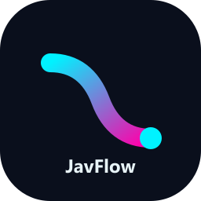

# ✦ JavFlow

<p align="center">
  
</p>

> 🎯 **JavFlow 是一款 Windows 桌面工具，用来把 JAV 影片从资料抓取、视频整理、订阅追更，到 Emby / Jellyfin 媒体库刮削串成一条本地工作流。**

[](https://github.com/Dyeink02/javflow) [](./LICENSE) [](https://wails.io/)

🪟 Windows 10 / 11　·　🏠 本地运行　·　🧩 Wails + Go　·　🎞 Emby / Jellyfin

**🕷️ 抓取资料 → 📁 整理文件 → 🔔 追踪更新 → 🎬 生成媒体库元数据**

✨ 不需要 Docker，不需要命令行。下载 Windows EXE，配置好目录和网络环境，就可以从一个界面完成整套流程。

---

## 🧭 这个项目用来做什么

JavFlow 面向需要维护本地 JAV 影片库的用户。它不负责播放视频，而是负责把影片从“找到资料”推进到“被媒体服务器正确识别”：

| 🧩 工作区 | 🎯 解决的问题 | 📦 主要产物 |
| --- | --- | --- |
| 🕷️ **JAV 爬虫** | 批量获取影片信息、封面和磁力链接 | `filmData.json`、`magnet-links.txt`、封面、运行日志 |
| 📁 **视频整理** | 识别番号，清理重复文件并整理命名 | 规范化的视频目录和整理报告 |
| 🔔 **订阅** | 持续关注女优、片商或系列的新片 | 更新检测结果和增量抓取结果 |
| 🎬 **媒体库刮削** | 为本地影片补齐媒体服务器需要的资料 | NFO、poster、backdrop、landscape、演员头像 |

🎬 刮削完成后，生成的目录可以交给 **Emby** 或 **Jellyfin** 扫描；播放和媒体库管理仍由它们负责。

## 💡 为什么会有这个项目

这类媒体库的日常维护通常被拆在几个工具里：一个工具找资料，一个脚本整理文件，另一个刮削器生成 NFO。真正麻烦的地方不是某一步做不到，而是每一步之间都要手动复制番号、移动目录、检查结果，再重新配置下一步。

JavFlow 想解决的就是这段重复衔接：

```text
🕷️ 抓取影片资料
      ↓
📁 按番号整理本地视频
      ↓
🔔 按女优 / 片商 / 系列追踪更新
      ↓
🎬 匹配元数据并生成 NFO / 图片
      ↓
📚 交给 Emby / Jellyfin 建立媒体库
```

🏠 项目采用本地优先的设计。爬虫、整理、订阅和刮削各自保持独立，通过稳定的结果文件和数据契约衔接，方便单独运行，也方便定位问题。

## 🛠️ 你可以用它完成什么

### 📚 从一堆文件变成可管理的媒体库

- 🔎 按番号识别视频文件，支持常见命名形式。
- ✍️ 统一重命名和目录结构，减少手工整理。
- ♻️ 同番号多版本时进行去重和版本优选。
- 🤖 可选启用广告片段检测，避免不必要的启动依赖。
- 📝 生成 Emby / Jellyfin 可以读取的 NFO 和图片文件。

### 🔁 从一次抓取变成持续追更

- 📄 抓取多页影片列表和详情页。
- 🧲 获取影片元数据、封面和磁力链接。
- 🛡️ 支持代理、镜像地址切换和浏览器兼容路径。
- ⭐ 按女优、片商或系列保存订阅目标。
- ⚡ 只处理订阅源中新增的番号，减少重复抓取。

### 🧑‍🎤 让演员资料在整个媒体库复用

- 🖼️ 自动获取演员图片。
- 📦 演员头像统一缓存在库根 `.actors` 目录。
- 🔄 多部影片可以复用同一份演员头像，避免重复下载。

## 🧭 典型使用方式

### 🧰 第一次整理媒体库

1. ⚙️ 在设置中配置媒体库根目录、输出目录和代理。
2. 🕷️ 使用 **JAV 爬虫** 获取影片资料和磁力链接。
3. 📁 将下载好的视频交给 **视频整理**，按番号完成识别和重命名。
4. 🎬 在 **媒体库刮削** 中扫描整理后的目录。
5. 📚 将生成的 NFO 和图片交给 Emby / Jellyfin 扫描。

### 🔔 后续自动追更

1. ➕ 在 **订阅** 中添加女优、片商或系列地址。
2. 🔎 执行更新检测，查看新增番号。
3. ⚡ 对新增内容执行增量抓取。
4. 🎬 整理新视频后再次执行刮削，补齐媒体库信息。

## 🚫 它不是什么

JavFlow 的边界很明确：

- ⛔ 它不是 Emby / Jellyfin，不负责视频播放。
- ⬇️ 它不是下载器，主要输出影片资料和磁力链接。
- ☁️ 它不是云端服务，应用和结果文件默认保存在本地。
- 🧹 它不会替你决定哪些文件最终删除；整理产生的待处理文件由你确认。

## 📦 下载与运行

### 🪟 Windows 用户

从 [GitHub Releases](https://github.com/Dyeink02/javflow/releases) 下载最新可用版本：

1. 📥 下载 Windows x64 的 `javflow.exe`。
2. ▶️ 双击运行，不需要安装 Docker 或额外启动服务。
3. ⚙️ 首次启动后配置代理、媒体库根目录和输出目录。

当前程序面向：

- 🪟 Windows 10 / 11（64-bit）
- 🌐 可用的网络环境或代理
- 💾 足够的媒体库和输出目录空间

## 🏷️ 版本更替

### v0.4 · 媒体库刮削加入主流程

**v0.4 最大的更新，是新增了媒体库刮削工作区。** JavFlow 从单纯的抓取和整理工具，扩展为可以一路处理到 Emby / Jellyfin 媒体库的本地工作流。

- 🎬 扫描本地影片目录，并按番号匹配影片资料。
- 📝 生成包含标题、演员、标签和发行日期等信息的 NFO 文件。
- 🖼️ 下载并写入 poster、backdrop、landscape 等媒体图片。
- 🧑‍🎤 自动获取演员头像，并缓存到库根 `.actors` 目录。
- 🔗 让爬虫结果、视频整理和媒体库刮削可以连续衔接。

## 🚀 未来更新

### 🎞️ 视频整理：智能广告片替换

在视频整理阶段自动识别“开头广告影片”，将其从目标目录移除，并自动重新获取对应番号的有效磁力链接，方便重新下载无广告版本。

### ☁️ 115 开放平台全流程打通

为 JAV 爬虫接入 115 开放平台 API，逐步实现：

```text
🕷️ 用户发起爬取请求
        ↓
☁️ 自动 115 离线下载
        ↓
📁 自动视频整理
        ↓
🔗 生成 STRM
        ↓
🎬 媒体库刮削
        ↓
🔔 自动添加订阅
```

目标是一条龙完成从爬取到入库的流程，减少在多个面板之间来回切换。

### ⭐ JAV 爬虫：演员榜单快捷操作

在演员榜单中增加更直接的操作入口：

- 🔗 演员名称一键打开对应网址。
- 🕷️ 一键跳转或启动该演员的爬虫任务。
- ⚡ 减少页面切换和复制粘贴操作。

## 🧑‍💻 从源码构建

🧰 环境要求：Go 1.25+、Node.js 18+、Wails CLI 2.x。

```bash
git clone https://github.com/Dyeink02/javflow.git
cd javflow
npm install
npm run build:desktop-frontend
npm run sync:wails-frontend
cd wails-shell
wails build -platform windows/amd64 -ldflags "-s -w"
```

运行测试：

```bash
# Go 后端
cd wails-shell
go test ./...

# Node 兼容层与构建侧测试
cd ..
npm test
```

## 🧱 技术结构

| 层级 | 技术与职责 |
| --- | --- |
| 🖥️ 桌面应用 | Wails v2，负责 Windows 窗口和 Go / Web 前端桥接 |
| ⚙️ 后端主链 | Go，负责爬虫执行、视频整理、订阅和媒体库刮削 |
| 🎨 前端界面 | 原生 HTML / JavaScript / CSS，无前端框架依赖 |
| 🧩 兼容侧车 | Node.js，负责构建脚本以及必要的浏览器挑战兼容 |
| 🎬 媒体库模块 | 集成 MetaTube SDK，并由 JavFlow 负责本地匹配和文件写入 |

主要目录：

```text
javflow/
├── wails-shell/       # Wails 应用与 Go 后端
├── desktop/            # HTML / JavaScript / CSS 前端
├── src/                # Node.js / TypeScript 兼容核心
├── test/               # Node 测试
├── scripts/            # 构建、同步和诊断脚本
└── docs/               # 设计与维护文档
```

## 🤝 开源项目与致谢

JavFlow 建立在多个开源项目之上，感谢这些项目的作者和贡献者：

| 项目 | 在 JavFlow 中的用途 |
| --- | --- |
| 🕷️ [raawaa/jav-scrapy](https://github.com/raawaa/jav-scrapy) | JAV 爬虫能力的上游来源，提供影片信息、磁力链接和海报等抓取基础。 |
| 🎬 [metatube-community/metatube-sdk-go](https://github.com/metatube-community/metatube-sdk-go) | 媒体库刮削使用的 Go SDK，提供影片 / 演员元数据搜索和 provider 能力。 |
| 🖥️ [Wails](https://wails.io/) | Windows 桌面应用框架。 |
| 🔷 [Go](https://go.dev/) | 后端主开发语言。 |
| 🌐 [Puppeteer](https://pptr.dev/) | 早期版本和兼容路径使用的浏览器自动化能力。 |

📜 本项目自身使用 MIT License；上游项目请以各自仓库中的许可证和版权说明为准。

## ⚠️ 免责声明

本项目仅供个人学习、研究和合法授权场景使用。使用时请遵守目标网站的服务条款，合理控制请求频率，不要将本项目用于未经授权的内容获取或商业用途。因使用本项目产生的任何责任由使用者自行承担。

