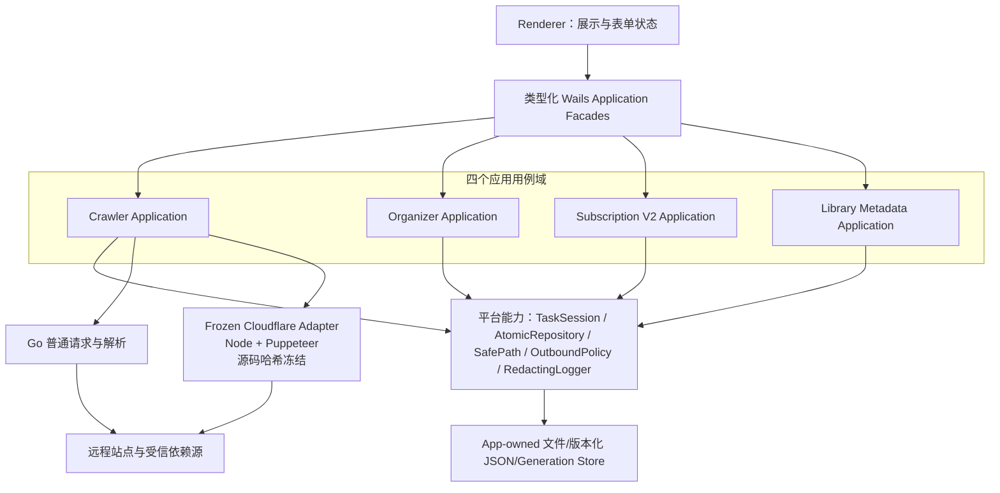
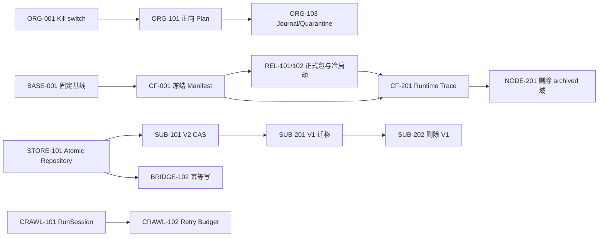

# JavFlow 项目全面审计与优化建议

> 审计日期：2026-07-28
> 审计对象：`E:\JAVAV\源码\javflow`
> 审计快照：`main` / `7e4def1bdaa96a24bbf054f018aa2c533bd48e26` 及当前未提交工作树
> 当前结论：**No-Go，不建议发布或用于无备份的真实媒体目录**
> 强制约束：**Cloudflare 绕过实现为冻结区，本报告不建议修改其代码、算法、时序、参数或依赖链。**

---

## 1. 执行摘要

### 1.1 一句话结论

JavFlow 不是真正的“20 万行业务代码”，但对四个主要功能板块来说仍然明显臃肿；更重要的是，当前存在可造成广泛数据删除的 Organizer 缺陷、不可运行的发布包、订阅并发丢更新/非原子持久化、爬虫无限重试与停止失效、以及多类可达安全漏洞。因此优先级必须是“阻断数据损坏和错误发布”，而不是立即做大规模重构。

### 1.2 发布决策

| 决策项 | 结论 | 核心依据 |
|---|---|---|
| 是否可发布 | **No-Go** | Organizer 可删除未扫描目录，且允许选择磁盘/共享根目录 |
| GitHub Portable 是否可用 | **不可用** | ZIP 仅有 EXE + frontend，启动却必须找到 `package.json`，sidecar 还需 Node、`desktop`、`dist` 和生产依赖 |
| 是否可直接删 Node | **不可** | Cloudflare 生产通道仍依赖 Node/Puppeteer 完整传递闭包 |
| 是否需要立即重写 | **不需要** | 先小范围修 P0/P1，再用可达性证明清退重复实现 |
| 当前测试是否足够 | **不足够** | 182 个 Node 测试与最新 Go 全量测试通过；但工作树变化期间媒体库曾短暂出现 2 项规则回归，且部分测试正在固化危险删除语义 |

### 1.3 对“20 万行是否太多”的直接回答

- Git 跟踪文本约 **128,829 行**，其中 Go/JS/TS/CSS/HTML 排除测试后约 **103,230 行**。
- “20 万行”主要是统计方法错误：370,070 字节的二进制 `build/icon.ico` 被 PowerShell `Get-Content` 误计为 **76,553 行**；`128,829 + 76,553 = 205,382`，基本就是“20 万行”的来源。
- 结论不是“代码量没问题”。四个板块同时存在 Go/Node 双轨、订阅 V1/V2 双轨、90 个 bridge Go 文件、默认禁用但未退役的 sidecar 域，这些才是臃肿的真正来源。
- 在不碰 Cloudflare 冻结闭包的前提下，第一轮可合理清退 **10,000-12,000 行非冻结生产代码**；中期在类型化 bridge 和订阅收敛后，总减量目标可设为 **15,000-25,000 行**，但不应为追求行数而合并成新的巨型文件。

### 1.4 最高风险摘要

1. **P0 - Organizer 广域删除**：关闭子目录扫描后，未扫描的顶层目录仍会被递归删除；磁盘根目录也能被选为 Organizer 根目录。
2. **P0 - 预览与实际执行不一致**：扫描记录声称根文件“已保留”，批量删除却会删除所有非白名单根条目。
3. **P1 - 发布包必然冷启动失败**：仓库里已有正确双轨打包脚本，Release workflow 却绕过它只复制 EXE 和 frontend。
4. **P1 - 订阅丢更新**：长时间网络刷新前读取整表，结束后 `ReplaceAll`，会覆盖期间的新增、删除、排序、媒体或抓取状态变更。
5. **P1 - JSON 损坏后静默变空**：订阅、settings 和爬虫产物多处原地截断写，部分读取器将解析失败当成空数据，下次保存可将数据永久覆盖。
6. **P1 - 写命令透明重试**：40 个 bridge 命令允许最多 6 次重试，包含整理、安装依赖、订阅增删和爬虫启停，但没有幂等键。
7. **P1 - 爬虫无限重试/停止不取消请求**：Go runner 使用 `context.Background()`，索引请求失败后无上限重试，并使用不可取消的 `time.Sleep`。
8. **P1 - 生产安全债务**：`npm audit --omit=dev` 有 12 项（1 critical），`govulncheck` 发现 20 个实际可达漏洞，远程图片解码链可达 OOM/panic 漏洞。
9. **P1 - SSRF/依赖供应链**：订阅头像只验证 HTTP/HTTPS；依赖下载缺大小限制、哈希、签名与解压上限，最终安装 EXE/DLL。
10. **P1 - 日志无轮转且可泄密**：本机 Node 日志已累计约 1.36 GiB；冻结区会记录完整 Cookie/响应头，应在统一 logger 出口脱敏，不改冻结实现。

---

## 2. 审计范围、方法与限制

### 2.1 审计快照说明

当前仓库不是干净工作树：审计时 `git status --porcelain` 共 60 个条目，其中 29 个已暂存、32 个有未暂存变更、5 个未跟踪。因此本报告评估的是 **2026-07-28 当前工作树**，不等同于 HEAD 提交本身。审计过程不回退、覆盖或格式化任何现有业务文件。

### 2.2 证据分级

| 标记 | 定义 | 报告用法 |
|---|---|---|
| 已确认 Bug | 存在清晰可达路径，或现有测试/静态分析已证明行为 | 可直接进入缺陷修复队列 |
| 高风险设计 | 需并发、损坏文件、异常索引或网络超时等前提，但缺乏必要防线 | 应补测试并尽快收口 |
| 优化建议 | 不会单独导致当前故障，但影响复杂度、效率或可演进性 | 按路线图分期实施 |

### 2.3 已执行的验证

| 命令/检查 | 结果 | 备注 |
|---|---|---|
| `npm test` | 通过 | TypeScript 构建通过，182 个 Node 测试通过 |
| `go test ./...` | 审计早期和最新最终复核均通过 | 中途变化中的工作树曾有 2 项 `librarymetadata` 规则测试失败；即使全绿也不代表危险删除语义正确 |
| `go build .` | 审计早期和最新最终复核均通过 | 仅证明源码可构建，不证明 Release ZIP 完整；固定 commit 后仍须由 CI 重跑 |
| `go vet ./...` | 通过 | 建议纳入 CI 显式步骤 |
| `go test -cover ./internal/...` | 通过 | 详细覆盖率见第 12 章 |
| `go test -cover .` | **失败** | `app.go:1:1 invalid BOM in the middle of the file` |
| `go test -race` | **未能执行** | Windows 环境缺少 GCC/CGO 工具链，并发正确性仍有残余风险 |
| `go run .../staticcheck@latest ./...` | **47 项** | `U1000` 26、`ST1005` 11、`SA4006` 3、其他 7 |
| `go run .../gocyclo@latest -over 15 .` | **71 个函数** | 生产函数 63 个，生产复杂度 `>=30` 有 5 个 |
| `gofmt -l .` | **52 个文件** | 当前 CI 未阻断未格式化 Go 代码 |
| `govulncheck ./...` | **20 个可达漏洞** | 来自 4 个模块和 Go 标准库 |
| `npm audit --registry=https://registry.npmjs.org` | **23 项** | 2 critical / 15 high / 5 moderate / 1 low |
| `npm audit --omit=dev ...` | **12 项** | 1 critical / 8 high / 3 moderate |
| `npm run verify:maintainability` | 通过 | 绿灯同时在固化部分 V1/archived 遗留，见第 11 章 |
| UTF-8/encoding 检查 | 通过 | 却没有拦截使 coverage 失败的 BOM |
| `go mod verify` | 通过 | 模块校验和通用漏洞扫描是两件事 |
| `go mod tidy -diff` | 通过/无差异 | 依赖图一致 |

### 2.4 审计限制

- 没有对用户真实媒体目录执行 Organizer 破坏性复现；结论来自调用链和临时目录测试语义。
- 没有修改或动态插桩 Cloudflare 冻结区；对该区只做静态边界识别和外围测试建议。
- 没有在干净 Windows VM 实际安装 GitHub Release ZIP；但“包中缺 `package.json` 而启动必查该文件”是确定性静态失败。
- 未完成 race detector，因此锁分析之外仍需 CI 动态并发验证。
- 本地 npm 默认镜像不支持 audit API，漏洞数量是显式指定 npm 官方 registry 后的结果。

---

## 3. Cloudflare 冻结区策略

### 3.1 不可越过的边界

用户明确要求 Cloudflare 绕过不能改动。因此以下文件以及它们的实际传递依赖，在完成可达性闭包前均应按冻结区处理：

- `src/utils/cloudflareBypass.ts`
- `src/core/requestHandler.ts` 中的 Cloudflare 恢复、Cookie、AJAX 和浏览器回退链
- `src/core/requestHandlerCloudflareUtils.ts`
- `src/core/cloudflareAjaxWorkerClient.ts`
- `src/core/puppeteerPool.ts`
- `src/core/puppeteerExecutablePath.ts`
- `src/workers/cloudflareAjaxWorker.ts`
- `src/core/queueManager.ts` 中的 Cloudflare 补抓队列与资源管理
- `desktop/sidecar/index.js`、`commandRouter.js`、`serviceRegistry.js`
- `desktop/sidecar/services/crawlService.js`、`crawlRuntimeFactory.js`、`goRunnerHost.js`
- `desktop/mainServices/runnerService.js`、`runtimeState.js`、`settingsStore.js`、`logBridge.js`
- Go 侧 `internal/sidecar`、`internal/antiblock`、爬虫模式选择、sidecar 协议与生命周期适配
- 上述入口在实际 Cloudflare 运行时 `require/import` 到的所有文件

**禁止事项：**

- 不重写、合并、格式化或“恢复类型”冻结文件。
- 不更改 Puppeteer 版本、启动参数、代理处理、Cookie 时序、池大小、重试、并发或回退顺序。
- 不以“legacy”、“compatibility”或 `@ts-nocheck` 为理由直接删除任何文件。
- 不把 Node 全量删除作为架构目标；目标是将 Node 收敛为一个不透明的 Cloudflare Adapter。

### 3.2 允许的外围治理

| 可以做 | 如何保证不破坏 Cloudflare |
|---|---|
| 日志脱敏 | 只在 `src/core/logger.ts` 等共享输出边界统一遮罩 `Cookie`、`Set-Cookie`、`Authorization`、带认证的代理 URL；不改冻结区内的日志调用 |
| 日志轮转 | 在 transport 配置中设定单文件上限、保留数和总配额 |
| 文件哈希冻结 | 对冻结闭包生成 SHA-256 manifest，PR 改动任意哈希即阻断 |
| 契约测试 | 从进程外检查 bootstrap/start/stop、Cookie 复用、代理切换、AJAX 补抓和错误回退，不插桩内部实现 |
| 发布包验证 | 在干净 VM 中使用包内 Node/Puppeteer 运行时，证明不依赖源码目录或系统 Node |
| 可达性分析 | 记录实际 `require/import`、生成依赖闭包；只删除证明不属于闭包的 archived 域 |

### 3.3 冻结区发布门槛

1. 冻结 manifest 中所有文件哈希必须与已知可用基线一致。
2. 每个 PR 执行离线字符化契约测试；实网 Cloudflare canary 放在定时/人工发布门，不将外网波动当成普通 PR 的随机失败。
3. 可便携包内 Node、Puppeteer 所需资产、`desktop`、`dist`、`package.json`、lockfile 和生产依赖必须完整。
4. 需同时检查普通 Go 通道和冻结 Cloudflare 通道，防止一条可用、另一条在发布包中缺资产。

---

## 4. 代码规模与臃肿来源

### 4.1 Git 跟踪文本口径

| 类型 | 文件数 | 行数 | 备注 |
|---|---:|---:|---|
| Go | 326 | 60,260 | 包含 99 个测试文件/约 12,070 行 |
| JavaScript | 161 | 39,324 | 包含 renderer、sidecar、兼容业务与 52 个 Node 测试 |
| TypeScript | 60 | 15,978 | 其中 8 个 `@ts-nocheck` 核心文件超过 5,200 行 |
| JSON | 5 | 6,138 | 包含 lockfile，不应等同业务逻辑 |
| CSS | 13 | 3,934 | UI 样式 |
| HTML | 9 | 1,563 | Wails 前端模板 |
| 其他文本 | - | 约 1,600 | 文档、脚本、workflow、Go module 元数据等 |
| **总计** | **598 文本 / 601 tracked** | **128,829** | 行数会因空行/换行统计工具有小幅差异 |

### 4.2 类生产代码口径

Go/JS/TS/CSS/HTML 排除 Go 和 Node 测试后约 **103,230 行**。这仍然不等于纯业务逻辑，因为它还包含：

- Wails bridge 与 DTO 粘合层；
- Node 兼容爬虫和 Cloudflare 必需闭包；
- 默认禁用的 archived organizer/learning/ranking 实现；
- V1/V2 订阅与订阅爬取双轨；
- 类编译 CommonJS 形态的 `.ts` 文件；
- UI 控制器和大量维护性字符守卫。

### 4.3 工作树生成物（不应计入源码 KPI）

| 目录 | 规模 | 结论 |
|---|---:|---|
| `desktop/renderer/.generated` | 约 21,841 行 / 0.77 MiB | 可再生成，已 ignore，不计源码 |
| `dist` | 约 12,933 行 / 1.06 MiB | Node 运行产物，发布必需，不应与 `src` 重复统计 |
| `node_modules` | 约 99.44 MiB / 10,359 文件 | 依赖缓存，不计源码，但要管控发布包生产依赖 |
| `wails-shell/build` | 约 79.54 MiB | 本地构建产物 |
| `wails-shell/release` | 约 237.32 MiB | 历史发布产物，应用 clean task 管理，不手工长期堆积 |

### 4.4 真正的臃肿点

| 臃肿源 | 当前证据 | 处置 |
|---|---|---|
| 订阅 V1/V2 并存 | App 同时实例化 4 套服务，前端实际只用 V2 | 先迁移与遥测，再删 V1，可减至少 3,351 行生产代码 |
| archived Node 域 | organizer/learning/ranking 默认被环境开关禁用 | 先生成 Cloudflare 可达闭包，再清退约 6.7k-8.1k 条件候选代码 |
| Go/Node 爬虫双轨 | Go 普通通道 + Node Cloudflare/兼容整体并存 | 不删冻结闭包；将 Node 收敛为专用 Adapter |
| bridge 碎片化 | 90 个 Go 文件/约 8,446 行，71 个命令分支 | 改为四个类型化门面，兼容 `Call` 只读适配 |
| Go 包过多 | `internal` 44 个包，18 个 `crawl*` 包 | 合并 stage/result/review/runcontext/uistate 为一个 projection 边界，不继续按小类型拆包 |
| 大文件与小文件并存 | 47 个非测试生产文件 >500 行，同时有过多微型 helper 文件 | 围绕用例/事务边界重组，而不是机械合并或继续细分 |
| 维护脚本过重 | maintainability runner + config 共 2,717 行 | 保留导入边界检查，删除强制旧命令/模板注释存在的字符守卫 |

---

## 5. 四大板块及平台评分

> 评分综合正确性、数据安全、安全性、可维护性、测试与可发布性，不代表功能多少或 UI 完成度。

| 板块 | 评分 | 评价 |
|---|---:|---|
| JAV 爬虫 | **5.5/10** | 解析、状态和输出测试基础最好，但停止/重试语义、Go/Node 双轨、发布资产缺失和冻结依赖运维成本高 |
| 视频整理 | **2.0/10** | 已确认广域删除和卷根目录防线缺失；69.9% 覆盖率无法弥补错误合同被测试固化 |
| AV 订阅 | **3.5/10** | 前端已走 V2，但 V1/V2 同时装配，刷新丢更新、JSON 静默变空、输出目录广删除，`subcrawlv2` 覆盖率仅 4.4% |
| 媒体库刮削 | **5.0/10** | Go 主线较明确，但图片链存在可达漏洞/SSRF 缺口，前端控制器过大，依赖安装关键路径 0% 覆盖 |
| 平台/发布 | **2.5/10** | CI 基础测试绿灯，但 portable 包结构必然无法启动，缺静态检查、漏洞门、race、clean-machine smoke 和签名 |

---

## 6. 分级风险登记表

### 6.1 P0：必须立即阻断

| ID | 类型 | 问题 | 影响 | 证据 |
|---|---|---|---|---|
| P0-01 | 已确认 Bug | Organizer 非批量收口删除所有非托管顶层目录，不管是否扫描 | 未扫描数据目录被递归删除 | [`run.go:177`](wails-shell/internal/organizer/run.go#L177)、[`run.go:222`](wails-shell/internal/organizer/run.go#L222)、[`run_context.go:304`](wails-shell/internal/organizer/run_context.go#L304)、[`fs_ops.go:248`](wails-shell/internal/organizer/fs_ops.go#L248) |
| P0-02 | 防线缺失 | Organizer 输入校验允许 `C:\`、`E:\` 或 UNC share root | 与 P0-01 组合后可删除数据盘大量顶层目录 | [`common.go:123`](wails-shell/internal/common/common.go#L123)、[`run_context.go:93`](wails-shell/internal/organizer/run_context.go#L93) |
| P0-03 | 已确认合同错误 | dry-run/扫描声称根文件已保留，batch apply 却删除所有非白名单根条目 | 用户根据错误预览批准不可逆操作 | [`run_scan_phase.go:91`](wails-shell/internal/organizer/run_scan_phase.go#L91)、[`run_batch_delete.go:118`](wails-shell/internal/organizer/run_batch_delete.go#L118)、[`service_test.go:332`](wails-shell/internal/organizer/service_test.go#L332) |

### 6.2 P1：发布前必须修复

| ID | 类型 | 问题 | 主要后果 |
|---|---|---|---|
| P1-01 | 已确认 Bug | 直接删除模式未保护已有“待删除”目录 | 人工待复核内容未扫描却被整目录删除 |
| P1-02 | 已确认 Bug | 一个待删文件便可触发整个父目录 `RemoveAll`/整包移动 | 扫描后新增文件、特殊文件或未入清单文件一并丢失 |
| P1-03 | 已确认 Bug | batch staging 删除失败声称“保留以便重试”，下次运行却按前缀无条件删除 | 无法恢复失败事务 |
| P1-04 | 高风险设计 | Organizer 没有后端运行互斥 | 同根并发任务互删 staging、竞争改名/报告 |
| P1-05 | 已确认 Bug | V1/V2 刷新用网络请求前的整表快照 `ReplaceAll` | 刷新期间的用户变更被旧状态覆盖 |
| P1-06 | 已确认 Bug | 订阅 JSON 解析错误被当成空列表，且原地 `WriteFile` | 断电/崩溃/并发半写后数据可永久清空 |
| P1-07 | 高风险设计 | 爬虫主产物损坏后静默以空记录启动，多文件顺序覆盖 | `filmData.json` 及派生产物可形成跨代混合或清空 |
| P1-08 | 高风险设计 | bridge 对整理、安装、订阅增删、爬虫启动等写命令透明重试 | 部分成功/响应丢失时重复执行非幂等副作用 |
| P1-09 | 已确认 Bug | form controller 离开工作区后只重置标志，不解绑 DOM 事件，返回时重复绑定 | 每次工作区切换都可增加一次启停/保存 API 调用 |
| P1-10 | 已确认 Bug | Go crawler 停止只设标记/关队列，不取消当前请求；索引失败无上限重试 | 停止超时、任务在持续网络故障下永不终止 |
| P1-11 | 已确认发布缺陷 | Release ZIP 缺启动必需的 `package.json`、Node sidecar 和运行时 | 干净机器上必然冷启动失败 |
| P1-12 | 已确认安全缺口 | 订阅头像 URL 允许 localhost/私网和跳转 | 本地服务访问、云元数据访问等 SSRF |
| P1-13 | 高风险设计 | 依赖下载无哈希/签名/字节上限/解压上限，最终落地 EXE/DLL | 供应链替换、磁盘耗尽、压缩炸弹、RCE |
| P1-14 | 已确认安全债务 | 生产 npm 12 项漏洞，Go 20 个可达漏洞 | 远程 HTML/图片/网络输入可触发 DoS、panic、OOM 等 |
| P1-15 | 已确认运维/隐私缺陷 | Node logger 默认 debug、三份重复日志、无轮转，冻结区记录完整 Cookie | 本机已约 1.36 GiB，磁盘与凭据泄露风险 |
| P1-16 | 高风险设计 | 订阅输出目录和 `subcrawlv2` 会删除目录中除当前 TXT 外的其他内容 | 输出目录所有权不明时误删用户文件 |
| P1-17 | 高风险设计 | 历史缓存删除信任索引中的产物路径并直接 `RemoveAll` 父目录 | 异常/被篡改索引可将删除目标引到 UserData 外 |

### 6.3 P2/P3：紧随数据安全修复

| ID | 级别 | 问题 |
|---|---|---|
| P2-01 | P2 | `OpenExternal` 未限定 `https/http`，直接交给系统 URL handler |
| P2-02 | P2 | 无 CSP；一旦 renderer 出现 XSS，弱类型 bridge 提供较大本地能力面 |
| P2-03 | P2 | settings 的 `Load -> mutate -> Save` 不在同一把锁中，Go/Node 又可共同原地写同一 JSON |
| P2-04 | P2 | 缓存索引只有 Upsert 使用统一锁，发现/单删/全清可与归档竞争 |
| P2-05 | P2 | 订阅删除不回收 `subscriptions-v2/media/<id>`，图片扩展名变化也留下孤儿 |
| P2-06 | P2 | V1/V2 的 error 状态可被 `PendingCount > 0` 覆盖成 updated；V1 空 URL 错误不进入失败统计 |
| P2-07 | P2 | `deleteIntervalMs`/`organizeIntervalMs` 被解析和保存，但未用于执行循环，限速 UI 配置无效 |
| P2-08 | P2 | 改名目标 `_DUP1..9999` 全存在时仍使用已存在目标，copy fallback 可 `O_TRUNC` 覆盖 |
| P2-09 | P2 | 8 个 `@ts-nocheck` 核心 `.ts` 是类编译 CommonJS，`strict: true` 对关键路径基本失效 |
| P2-10 | P2 | 47 项 Staticcheck、71 个高圈复杂度函数、52 个 gofmt 不一致文件没有进入 CI 阻断 |
| P2-11 | P2 | bridge 90 文件、71 命令，以 `string + map[string]any + JSON string` 为主协议，编译期保护弱 |
| P2-12 | P2 | `scraperRunner.ts` 写死 `APP_VERSION = '0.27'`，与项目 `0.4.0` 不一致 |
| P2-13 | P2 | `app.go` 和一个测试文件带 BOM，导致根包 coverage 插桩失败 |
| P2-14 | P2 | 前端大控制器缺直接单测，Node 测试无 coverage 统计/门槛 |
| P3-01 | P3 | 模板化 `Ownership summary`/`File map` 注释占用大量行数，但对真实失败语义帮助有限 |
| P3-02 | P3 | 错误语言、错误封装、日志接口不统一，部分中文以 Unicode escape 存在，增加阅读成本 |

---

## 7. 已确认 Bug 与逻辑漏洞详解

### 7.1 Organizer：当前最高优先级

#### 7.1.1 未扫描目录仍被收口删除

调用链：

```text
RunOrganizer
  -> scanFiles
       -> collectFiles(includeSubdirectories=false) 跳过所有子目录
  -> ...
  -> cleanupManagedDirectories
       -> compactRootDirectories
            -> 枚举所有根目录顶层目录
            -> 非托管/非保护目录 RemoveAll
```

[`fs_ops.go:248`](wails-shell/internal/organizer/fs_ops.go#L248) 明确在 `IncludeSubdirectories=false` 时不进入子目录；但 [`run_context.go:304`](wails-shell/internal/organizer/run_context.go#L304) 对所有非 batch 任务调用 [`compactRootDirectories`](wails-shell/internal/organizer/run.go#L177)，后者在 [`run.go:222`](wails-shell/internal/organizer/run.go#L222) 递归删除所有非保留顶层目录。

这不是“极端并发才可能发生”，而是普通选项组合就能触发。且当广告策略是“移入待删除”时，UI 不会展示“直接删除”确认，收口阶段仍使用 `RemoveAll`。

**立即处置：**

1. 在修复前，后端强制 `DryRun=true`，或整体禁用 Organizer destructive apply；不能只隐藏前端按钮。
2. 删除 broad compaction 语义。仅允许删除“本次 plan 清单中的明确文件”，不得以“不在白名单”反向推导删除目标。
3. 只能删除已证明为空、且由本次运行创建的目录；用户源目录禁止 `RemoveAll` 收口。

#### 7.1.2 卷/共享根目录没有被拒绝

[`ValidateWritableDirectoryPath`](wails-shell/internal/common/common.go#L123) 只检查非空、NUL、`..` 和绝对路径；`C:\`、`E:\` 本身均通过。Organizer 在 [`run_context.go:93`](wails-shell/internal/organizer/run_context.go#L93) 直接复用该校验。

**必须同时实施的防线：**

- 拒绝 `filepath.VolumeName(cleaned) == cleaned`、`filepath.Dir(cleaned) == cleaned` 和 UNC share root。
- 拒绝系统目录、用户 home 根、Documents 根、应用 UserData 根和仓库根作为 destructive root。
- 建议第一次初始化专用整理目录时创建 `.javflow-organizer-root` 所有权标记；后端 apply 必须验证标记。
- destructive apply 要提交 `planId + planHash + rootIdentity`，后端重新计算后一致才执行。

#### 7.1.3 batch 语义是“删所有非白名单内容”，不是“删已识别广告”

[`collectBatchDeleteTargets`](wails-shell/internal/organizer/run_batch_delete.go#L118) 枚举根目录所有条目，只排除托管白名单与移动失败保护路径。现有测试在 [`service_test.go:332`](wails-shell/internal/organizer/service_test.go#L332) 明确要求删除 `root-junk.txt`、非名单目录等；UI 在 [`organizerController.js:594`](desktop/renderer/organizerController.js#L594) 也告知“其余内容”会删除。因此 batch 广删除本身是当前明示产品语义，不应错误描述为隐藏偶发分支。

真正的确认 Bug 是：[`run_scan_phase.go:91`](wails-shell/internal/organizer/run_scan_phase.go#L91) 对根文件记录“已保留，避免误删”，实际 batch apply 会删除它。即 dry-run/报告与 apply 的合同不同。

**产品建议：**即使用户了解“其余全删”，也应改成正向 plan，逐条展示删除与保留计划，默认移入可恢复隔离区，不直接永久删除。

#### 7.1.4 其他 Organizer 数据风险

- **“待删除”未保护**：[`managedDirectoryNames`](wails-shell/internal/organizer/file_utils.go#L134) 只在 `includeDelete=true` 时保留该目录；[`run.go:181`](wails-shell/internal/organizer/run.go#L181) 在 `delete-directly` 传 `false`。扫描阶段跳过这个托管目录，最后又可将它整目录删除。
- **一个文件决定整目录命运**：[`run_transfer_phase.go:172`](wails-shell/internal/organizer/run_transfer_phase.go#L172) 从待删文件父目录生成目录候选，[`run_transfer_phase.go:205`](wails-shell/internal/organizer/run_transfer_phase.go#L205) 直接删整目录。应在执行瞬间重新枚举，只有“实际条目集 == plan 待删集”才允许目录级优化，否则逐文件处理。
- **staging 不可恢复**：[`run_batch_delete.go:97`](wails-shell/internal/organizer/run_batch_delete.go#L97) 声称保留失败 staging，下次运行却在 [`run_batch_delete.go:164`](wails-shell/internal/organizer/run_batch_delete.go#L164) 仅按前缀删除。staging 必须有 run ID、manifest、状态、锁和显式恢复/提交操作。
- **无后端互斥**：Organizer `Service` 没有运行锁，bridge 可直接调用。应按规范化根路径加进程内锁，并用 lock file 防跨进程冲突。
- **大小写不一致**：扫描时托管目录匹配大小写不敏感，最终保留 map 使用原始名。Windows 上已有 `LOGS`/`Logs` 等变体存在误删风险。
- **冲突后缀耗尽**：[`fs_ops.go:108`](wails-shell/internal/organizer/fs_ops.go#L108) 穷尽 9999 个目标后未报错，后续 copy fallback 以 `O_TRUNC` 打开已存在目标。必须在未找到空闲名时 fail closed。
- **限速配置无效**：`deleteIntervalMs` 和 `organizeIntervalMs` 被解析/持久化，但未用于执行循环。UI 应不显示无效开关，或实现可取消限速。

### 7.2 缓存快照删除边界

[`RemoveCacheSnapshot`](wails-shell/internal/contracts/crawlartifact/cache_index.go#L614) 对 `crawler-history` 使用“第一个存在的产物文件”的父目录，然后在 [`cache_index.go:635`](wails-shell/internal/contracts/crawlartifact/cache_index.go#L635) 直接 `RemoveAll`，但没有验证该父目录必须位于 `<UserData>/crawl-artifacts`。异常或被手工篡改的索引可指向外部目录。

需要澄清一个易误判点：如果三个产物都已不存在，`filepath.Dir("") == "."`，但当前 Go `os.RemoveAll(".")` 会拒绝删除当前目录，因此“自动清空工作目录”不是当前可确认行为；该情况的实际 Bug 是失效快照无法删除。真正的高风险是信任索引路径且没有 containment。

**修复要求：**

- 空路径、`.`、卷根、非绝对路径立即拒绝。
- `Clean + Abs + EvalSymlinks + Rel` 后确保目标严格位于 app-owned cache root 下。
- 先重命名到同卷隔离区，再原子更新索引，最后异步清理。
- 发现、Upsert、单删、全清、归档必须共用同一事务锁。
- 测试覆盖 stale history、外部绝对路径、symlink/junction、空产物路径和运行中清缓存。

### 7.3 AV 订阅持久化和输出

#### 7.3.1 刷新旧快照覆盖新状态

V2 [`RefreshAll`](wails-shell/internal/avsubscriptionv2/refresh.go#L19) 在不持有事务锁时读取整表，执行长时间网络扫描，最后在 [`refresh.go:50`](wails-shell/internal/avsubscriptionv2/refresh.go#L50) 整表 `ReplaceAll`。`RefreshOne` 也在 [`refresh.go:57`](wails-shell/internal/avsubscriptionv2/refresh.go#L57) 读旧数组，最后整表替换。刷新期间的 `Patch/Upsert/Remove/Reorder/SetMedia/MarkCrawlCompleted` 可全部被覆盖。V1 有同类问题。

**正确语义：**

1. 网络请求不持有全局锁；请求返回的是 `RefreshPatch{id, baseVersion, fields...}`。
2. 提交时重新读取当前记录，仅合并刷新所拥有字段，不覆盖排序、媒体、用户编辑或抓取完成状态。
3. 用 `revision`/CAS 检测冲突；冲突时重新合并或明确返回 conflict，禁止静默覆盖。

#### 7.3.2 JSON 损坏被当成空列表

V2 在 [`storage.go:62`](wails-shell/internal/avsubscriptionv2/storage.go#L62) 将 `json.Unmarshal` 失败返回为空数组 + nil error，保存在 [`storage.go:87`](wails-shell/internal/avsubscriptionv2/storage.go#L87) 直接 `os.WriteFile`。V1 在 [`avsubscription/storage.go:53`](wails-shell/internal/avsubscription/storage.go#L53) 和 [`storage.go:79`](wails-shell/internal/avsubscription/storage.go#L79) 同样处理。`List()` 不加锁，可与原地截断写并发。

**必须 fail closed：**解析失败时不得返回空列表，不得接受后续 mutation；先恢复备份或让用户选择。写入应用同目录临时文件、`Sync`、原子 `Rename`、目录 sync，并保留最后 2-3 个可验证 generation。

#### 7.3.3 输出目录删除语义过广

- [`cleanupSubscriptionRootArtifacts`](wails-shell/internal/bridge/api_subscription_v2_output.go#L96) 删除订阅根下所有顶层文件和特定目录。
- [`cleanupSubscriptionActorArtifacts`](wails-shell/internal/bridge/api_subscription_v2_output.go#L123) 除日期 TXT/当前成功结果外删除演员目录其他所有内容。
- [`subcrawlv2.writeSubscriptionResult`](wails-shell/internal/subcrawlv2/crawl_loop.go#L493) 在写完 TXT 后对其他每个条目 `RemoveAll`；对应测试正在断言目录最终只能剩一个 TXT。

如果这些目录是 app-owned workspace，必须通过所有权标记和专用子目录强制这一点；如果用户可选任意现有目录，则当前行为属于高风险误删。建议改为 `runs/<run-id>` 世代目录 + `current.json` 指针，不清空用户目录。

### 7.4 Crawler 生命周期、重试和产物

#### 7.4.1 停止不能取消当前请求

[`runActiveRunnerAsync`](wails-shell/internal/bridge/api_crawl_runner_lifecycle.go#L76) 使用 `runner.Run(context.Background())`。[`Runner.Stop`](wails-shell/internal/crawlrunner/runner.go#L264) 只设置 `isStopping` 并关闭队列，没有保存/调用 run cancel function。bridge 最多等待 30 秒后返回超时。

**修复方向：**启动时创建 `context.WithCancelCause`，Runner 所有 HTTP、队列、延迟、恢复阶段都只使用同一 run context；`Stop` 首先 cancel，再等待有界 shutdown，并保证最终状态只提交一次。

#### 7.4.2 索引失败无上限重试

[`runner.go:955`](wails-shell/internal/crawlrunner/runner.go#L955) 在索引页请求失败后计算延迟，[`runner.go:959`](wails-shell/internal/crawlrunner/runner.go#L959) 用 `time.Sleep` 后 `continue`，没有最大次数、最大总时间或不可重试错误分类。应改为：

- 每页最大尝试数 + 任务总 retry budget；
- 针对 4xx、解析错误、认证失败的明确非重试分类；
- 全抖动指数退避，但尊重 `ctx.Done()`；
- `select { case <-timer.C; case <-ctx.Done(): }` 替代 `time.Sleep`；
- 超过 budget 后进入明确 `failed/partial` 终态，保留可恢复检查点。

#### 7.4.3 主产物原地覆盖

[`crawloutput/output.go:156`](wails-shell/internal/crawloutput/output.go#L156) 在旧 `filmData.json` 解析失败时直接返回，Writer 继续以空记录运行；[`output.go:384`](wails-shell/internal/crawloutput/output.go#L384) 原地覆盖 JSON，之后再顺序写 magnet/profile/organizer codes/cache index。任意一步崩溃都可产生跨代产物。

建议将一次 flush 定义为 generation 事务：先在 `generations/<id>.tmp` 写全部文件，校验数量/哈希，再原子改名为完整 generation，最后原子切换 `current` manifest。

### 7.5 前端工作区切换导致重复事件

[`formController.dispose`](desktop/renderer/formController.js#L1192) 只停止代理定时器，然后将 `eventsBound=false`，但没有任何 `removeEventListener`。[`renderer.js:224`](desktop/renderer/renderer.js#L224) 在离开 crawler 时调用 dispose，回到 crawler 时再调用 bootstrap；bootstrap 在 [`formController.js:1176`](desktop/renderer/formController.js#L1176) 重新绑定所有点击/输入事件。

这意味着每次离开并返回 crawler 工作区，启动、停止、保存、清日志等操作都可增加一个 handler。同时 `stopProxyAutoValidation()` 将 `autoValidationStopped=true`，bootstrap 没有恢复，代理自动验证在第一次离开后可永久停止。

**修复：**事件只绑定一次，dispose 只暂停运行时定时器；或每次 bootstrap 创建 `AbortController`，所有 listener 使用 `{signal}`，dispose 时 abort。测试应循环切换 10 次，然后点击一次只触发一次 bridge 调用。

---

## 8. 安全专项审计

### 8.1 威胁模型与信任边界

JavFlow 是本地桌面应用，但“本地应用”不等于低风险。Renderer 能调用具有文件删除、网络下载、进程启动和配置写入能力的 bridge；Crawler、订阅头像、媒体图片和依赖安装又会处理不可信远程输入。因此至少存在以下五类信任边界：

| 输入/边界 | 当前能力 | 主要风险 | 应有控制 |
|---|---|---|---|
| Renderer -> Wails bridge | 71 个字符串命令，可触发整理、安装、抓取、文件写入 | XSS 或调用错误被放大成本地高权限操作 | 类型化命令、最小暴露、输入 schema、命令授权与审计 |
| 远程站点 -> Crawler/图片解码 | HTML、JSON、图片、Cookie、重定向 | SSRF、解析器 DoS、OOM、panic、隐私泄露 | 统一出站策略、字节上限、超时、内容类型和解码预算 |
| Renderer URL -> 依赖安装器 | 下载并解压 EXE/DLL，随后执行探测 | 供应链 RCE、压缩炸弹、磁盘耗尽 | 固定清单、HTTPS/域名白名单、SHA-256/签名、解压配额 |
| 本地 JSON/缓存索引 -> 文件系统 | 读取路径后 `RemoveAll`，多进程原地写 | 路径逃逸、损坏后清空、并发丢更新 | app-owned root、containment、原子 store、CAS、事务锁 |
| Release workflow -> 用户机器 | 组装可执行文件、sidecar、Node 运行时 | 包缺件、依赖漂移、未签名代码 | 可复现构建、SBOM、签名、干净机器冷启动验收 |

安全修复应首先放在共享边界，而不是散落在每个调用点。尤其是 Cloudflare 冻结区，内部实现不允许修改，所有防护必须在其输入、输出、进程权限、网络策略和日志出口完成。

### 8.2 SSRF：订阅头像与媒体库图片

#### 订阅头像链

[`api_subscription_v2_media.go:196`](wails-shell/internal/bridge/api_subscription_v2_media.go#L196) 只接受 `http/https` scheme，[`api_subscription_v2_media.go:199`](wails-shell/internal/bridge/api_subscription_v2_media.go#L199) 随后使用会自动跟随重定向的普通客户端。当前测试 [`api_subscription_v2_media_test.go:15`](wails-shell/internal/bridge/api_subscription_v2_media_test.go#L15) 直接使用本机 `httptest` 服务并要求请求成功，等于把 localhost 可达性固化成了合同。

#### 媒体库绕过链

媒体写入优先选择 provider `ImageFetcher`：[`writer.go:199`](wails-shell/internal/librarymetadata/writer.go#L199) -> [`service.go:282`](wails-shell/internal/librarymetadata/service.go#L282)。这条路径没有经过 [`writer.go:400`](wails-shell/internal/librarymetadata/writer.go#L400) 后备 HTTP 下载器已有的私网/DNS 校验。Renderer 又可直接提交 `MovieInfo`，因此不能假设 URL 一定来自可信 provider。现有防线只保护失败后的 fallback，主路径反而绕过。

#### 统一修复标准

出站策略必须成为 provider 外围的唯一入口，所有头像、封面、背景图、依赖下载和普通 HTTP 抓取按用途取得策略化 client：

1. 只允许明确 scheme；依赖下载只允许 HTTPS。
2. 解析 DNS 后拒绝 loopback、private、link-local、multicast、CGNAT、云 metadata 地址和 IPv4-mapped IPv6。
3. `DialContext` 连接到已验证 IP，避免校验后 DNS rebinding。
4. 每一跳重定向重新校验 scheme、hostname 和实际地址；限制跳转次数。
5. 使用代理时不能因为“由代理解析 DNS”而跳过策略；至少限制来源域和目标域。
6. 图片请求限制响应头时间、总时长和压缩/未压缩字节数；先探测尺寸，再在像素预算内解码。
7. 将 blocked reason 以不包含 Cookie/Authorization 的结构化事件记录，便于定位而不泄密。

### 8.3 依赖安装链可形成供应链 RCE

当前路径是：

```text
Renderer 提交 URL
  -> bridge 转发
  -> 允许 HTTP/字面 IP 检查
  -> 无哈希、签名、长度上限地下载
  -> 无展开配额地解压
  -> 将 EXE/DLL 作为依赖安装
  -> 执行 ffmpeg.exe -version 等探测
```

证据位于 [`api_dispatch_dependency.go:36`](wails-shell/internal/bridge/api_dispatch_dependency.go#L36)、[`dependency/service.go:51`](wails-shell/internal/dependency/service.go#L51)、[`dependency/service.go:334`](wails-shell/internal/dependency/service.go#L334)、[`dependency/service.go:449`](wails-shell/internal/dependency/service.go#L449) 和 [`dependency/service.go:568`](wails-shell/internal/dependency/service.go#L568)。这不是普通“下载不安全”，而是下载结果最终进入可执行链，风险等级应按本地代码执行评估。

**目标设计：**

- 业务 API 只接收 `dependencyId + approvedVersion`，不再接收任意下载 URL。
- 发布仓库维护签名的 `dependencies.lock.json`，记录平台、架构、来源 URL、SHA-256、压缩格式、展开后文件清单和最大尺寸。
- 下载到 app-owned 临时目录，流式计算哈希；不匹配即删除临时文件且绝不执行。
- 限制压缩包字节数、文件数、单文件大小、总展开大小、路径深度和压缩比；拒绝绝对路径、`..`、junction/symlink 和设备名。
- 解压完成后逐文件核对 manifest，再原子发布到带版本目录；`current` 仅指向完整版本。
- 安装器默认只允许官方域；代理/镜像必须是管理员配置的显式白名单并有独立哈希，不允许 renderer 临时覆盖。
- Windows 对可执行文件验证 Authenticode；供应商无签名时至少使用项目维护的固定 SHA-256，并记录风险例外。

### 8.4 可达依赖漏洞

#### Node 生产依赖

`npm audit --omit=dev --registry=https://registry.npmjs.org` 报告 **12 项生产漏洞：1 critical / 8 high / 3 moderate**；全量依赖为 **23 项：2 critical / 15 high / 5 moderate / 1 low**。直接受影响的依赖包括 [`package.json:11`](package.json#L11) 的 `axios@1.13.2` 和 [`package.json:17`](package.json#L17) 的 `magnet2torrent-js`；`basic-ftp@5.0.5` critical 经 Puppeteer 生产依赖链进入，`handlebars` critical 位于开发/发布链。

#### Go 可达漏洞

`govulncheck@v1.3.0 ./...` 报告 **20 个符号级可达漏洞**。最低升级目标：

| 组件 | 当前审计版本 | 最低修复目标 |
|---|---:|---:|
| Go toolchain | 1.26.2 | 1.26.5 或更新补丁版 |
| `golang.org/x/net` | 0.52.0 | 0.55.0 或更新 |
| `golang.org/x/image` | 0.37.0 | 0.43.0 或更新 |
| `golang.org/x/text` | 0.35.0 | 0.39.0 或更新 |
| `github.com/jackc/pgx/v5` | 5.8.0 | 5.9.2 或更新 |

`x/image` 的漏洞不是不可达的“依赖树噪音”：远程图片数据会到达 [`writer.go:428`](wails-shell/internal/librarymetadata/writer.go#L428) 的 `image.Decode`，包含 OOM、panic 或资源耗尽风险。

依赖升级不得直接修改 Cloudflare 冻结实现。正确顺序是：锁定冻结文件哈希 -> 在独立分支升级外围依赖/运行时 -> 跑普通通道与 Cloudflare 黑盒契约 -> 做真实站点 canary -> 仅在结果一致时合并。若升级必然改变冻结闭包依赖，应作为单独风险评审，不可与普通重构混合。

### 8.5 日志泄密与磁盘失控

[`src/core/logger.ts:52`](src/core/logger.ts#L52) 默认 `debug`，三个文件 transport 没有 `maxsize`、`maxFiles` 或总量配额；[`src/utils/errorHandler.ts:51`](src/utils/errorHandler.ts#L51) 会记录完整请求头。现场 `C:\Users\Administrator\.jav-scrapy\logs` 的三个日志文件合计 **1,460,874,618 bytes（1.361 GiB）**，其中 combined/debug 各约 711 MB。

只做了模式计数，没有在报告中读取或输出任何秘密值：combined/debug 各有约 240,737 行命中敏感字段关键词，各有 17,240 行符合 `cookie=value` 等疑似值模式；error 中相应计数为 2,640 和 2,375。冻结 Cloudflare 文件内部确实会打印完整 Cookie，但依据约束不能改它。

**外围修复：**

```text
任意 logger 调用（包括冻结区）
  -> normalize metadata
  -> recursive redaction
  -> size/depth truncation
  -> emitToListeners
  -> console/file transports with rotation
```

脱敏必须发生在 UI 事件转发和所有 transport 之前；字段名匹配 `cookie`、`set-cookie`、`authorization`、`proxy-authorization`、`password`、`token`，并处理嵌套对象、Axios config/error、URL userinfo 和字符串化 header。生产默认 `info`，单文件建议 10-20 MiB、总量硬上限 100-200 MiB、保留 7-14 天。测试使用 canary secret，断言所有日志文件、console capture 和 UI 事件中零明文。

### 8.6 明文秘密和设置并发

Cookie、Cloudflare Cookie 和可能带账号密码的代理当前写入明文 `desktop-settings.json`，保存路径见 [`settings/store.go:167`](wails-shell/internal/settings/store.go#L167)。同时 Go 与 Node store 均可原地写该文件，`Load -> mutate -> Save` 也不是单一事务，存在秘密泄露和丢更新两类问题。

建议把普通非敏感设置保留在版本化 JSON；Cookie、代理凭据、API token 改为 `secretRef`，实际值存 Windows Credential Manager/DPAPI。迁移时读取旧明文一次，写入凭据库并原子替换设置；确认新版本可读后才清除旧值。日志、错误、导出和诊断包均只显示凭据 ID 与末尾 4 位摘要，不显示明文。

### 8.7 Renderer、外链和 CSP

- [`dialogs.go:131`](wails-shell/internal/desktop/dialogs.go#L131) 将外链交给系统 handler，没有协议白名单。只应允许规范化的 `https/http`；文件、命令和自定义协议必须走独立的显式命令。
- [`renderer/index.html:34`](wails-shell/frontend/desktop/renderer/index.html#L34) 没有 CSP 且含内联脚本。应先以 report-only 收集违规，再使用 hash/nonce 移除 `unsafe-inline`，限制 `connect-src`、`img-src` 和 `frame-src`。
- CSP 不能替代 bridge 最小权限。即使 renderer 被注入脚本，后端仍必须拒绝卷根目录、任意依赖 URL、UserData 外删除和无确认的 destructive apply。

### 8.8 Cloudflare 冻结区残余 TLS 风险接受

[`requestHandler.ts:184`](src/core/requestHandler.ts#L184) 在证书错误后可将 `strictSSL=false`，后续 agent 使用 `rejectUnauthorized:false`。该链高度耦合 Cloudflare 兼容逻辑，本报告明确 **不建议直接修改**。

在冻结约束下，应建立书面风险接受：限定允许访问的站点域、将 sidecar 运行在低权限账户/Job Object 中、限制可读目录和出站范围、缩短秘密寿命、对日志先脱敏、在 UI 明确显示当前是否处于兼容 TLS 模式，并为风险接受指定负责人、到期日和复审条件。若未来要消除此风险，应作为独立 Cloudflare 兼容性项目，不与当前数据安全修复捆绑。

---

## 9. 发布、打包与 CI/CD 审计

### 9.1 当前 Release ZIP 的确定性冷启动失败

[`wails-shell/main.go:24`](wails-shell/main.go#L24) 启动前寻找 `package.json`，找不到时在 [`main.go:78`](wails-shell/main.go#L78) 终止。sidecar 随后还需要 Node、`desktop/sidecar/index.js`、`dist` 和生产依赖，证据见 [`sidecar/manager.go:123`](wails-shell/internal/sidecar/manager.go#L123)、[`sidecar/manager.go:181`](wails-shell/internal/sidecar/manager.go#L181) 和 [`crawlService.js:29`](desktop/sidecar/services/crawlService.js#L29)。

但 [`release.yml:53`](.github/workflows/release.yml#L53) 只复制 EXE 和一份外置 frontend。前端本身已经嵌入 EXE，额外 frontend 也不能按 workflow 注释所说在运行时替换；真正需要的 sidecar 资产反而缺失。因此该 ZIP 在仓库外目录冷启动失败是确定性合同错误，不是偶发环境问题。

仓库已有 [`build-wails-dual-packages.js:183`](scripts/build-wails-dual-packages.js#L183) 复制 sidecar、`dist`、package 元数据和生产依赖的逻辑。Release workflow 应调用唯一的正式 packager，不应再维护第二套手写复制清单。

### 9.2 发布包必须声明运行闭包

建议发布 manifest 至少包含：

```text
javflow/
  JavFlow.exe
  package.json
  package-lock.json
  desktop/sidecar/**
  desktop/mainServices/**        # 仅实际 runtime 闭包
  dist/**                        # 与 src 基线对应的编译产物
  node/**                        # 固定版本便携 Node；不得依赖系统 Node
  node_modules/**                # 仅 production + 冻结闭包实际依赖
  runtime-manifest.json          # 文件路径、长度、SHA-256、来源版本
  LICENSES/
  SBOM.cdx.json
```

Puppeteer/浏览器资产是否内置必须由 manifest 明确，不能依赖开发机全局 cache。所有路径解析都应以 EXE 所在目录或受控 UserData 为根，禁止静默回落到 `JAVFLOW_REPO_ROOT` 或当前 checkout。

### 9.3 干净机器发布验收

现有 [`smoke-desktop-ui.js:156`](scripts/smoke-desktop-ui.js#L156) 从仓库环境启动，未设置隔离 `cwd`，会掩盖缺失资源。正式 smoke 必须：

1. 在构建机外创建全新 Windows VM 或 Windows Sandbox。
2. 将 ZIP 解压到不在任何 Git checkout 下的随机目录。
3. 清除 `JAVFLOW_REPO_ROOT`、`NODE_PATH` 等开发环境变量，PATH 中不得有系统 Node。
4. 以解压目录为 `cwd` 启动，验证 Wails UI、sidecar bootstrap、health、start/stop。
5. 运行一次普通 Go 抓取模拟和一次冻结 Cloudflare adapter 契约 smoke。
6. 验证 Organizer 默认不可 destructive apply，订阅/媒体库能在全新 UserData 初始化。
7. 关闭后确认无残留进程、锁文件可恢复、日志有轮转且无 canary secret。
8. 将测试产生的 UserData、进程树、日志和退出码作为 CI artifact，失败时可诊断。

### 9.4 构建真实性、签名和 SBOM

当前 EXE 的 Authenticode 状态为 `NotSigned`。同渠道提供 ZIP 的 SHA-256 只能检测下载损坏，不能证明发布者身份。正式发布至少应做到：

- EXE/安装器 Authenticode 签名并使用可信时间戳；
- Git tag 受保护，构建只从 tag 对应 commit 产生；
- 生成 CycloneDX/SPDX SBOM，列出 Go module、npm production dependency、Node/Puppeteer runtime 和外置二进制；
- 输出 provenance/构建参数、toolchain 版本和 runtime manifest；
- 发布包内每个可执行文件都有来源、版本、哈希和许可证；
- release artifact 在上传前完成病毒扫描、签名验证和冷启动 smoke。

### 9.5 建议 CI 门禁

| 阶段 | 必跑项 | 阻断条件 |
|---|---|---|
| Format/encoding | `gofmt -l`、UTF-8 no-BOM、ESLint/Prettier（冻结文件排除） | 任意非冻结文件不一致 |
| Compile/test | `go test ./...`、`go build .`、`npm test` | 任意失败 |
| Static | `go vet`、Staticcheck、类型检查、import boundary | 新增 `SA*`、冻结区外 `U1000` 或边界违规 |
| Security | `govulncheck`、npm production audit、CodeQL、secret scan | 可达 critical/high 未登记例外 |
| Concurrency | Windows/Linux 可执行的 `go test -race` job | 关键包 race |
| Coverage | 风险包差异覆盖率 + 包级底线 | destructive/persistence/bridge 路径低于门槛 |
| Package | 唯一 packager、runtime manifest、SBOM、签名 | manifest 缺件或哈希不符 |
| E2E | checkout 外、无系统 Node 的 Windows 冷启动 | UI/sidecar/stop 任一步失败 |
| Frozen CF | SHA-256 manifest + 黑盒契约 | 文件哈希变化或合同失败 |

Dependabot/Renovate 只能提升级 PR，不能自动合并 Cloudflare 传递闭包更新。冻结闭包依赖更新必须走专门标签、真实站点 canary 和人工批准。

---

## 10. 四大功能板块深入评估

### 10.1 JAV 爬虫

#### 现有优点

- Go 侧对状态机、解析、产物和恢复已经有较多纯逻辑测试，`crawlrunner` 覆盖率约 61.7%。
- 普通请求通道与 Cloudflare/年龄验证兼容通道已有概念上的分流基础。
- 产物合同被拆到 `crawloutput`、`crawlartifact` 等包，具备继续收敛的基础。

#### 核心问题

1. **生命周期不闭合**：bridge 用 `context.Background()` 启动，Stop 没有 run cancel，最长等待 30 秒只是调用者超时，并不保证任务停止。
2. **重试没有预算**：索引页失败会无限 `continue`；`time.Sleep` 不响应取消；4xx、认证失败和永久解析错误没有明确分类。
3. **多产物非事务**：主 JSON、magnet、profile、organizer codes 和 cache index 顺序落盘，可形成不同 generation 的混合状态。
4. **Go/Node 所有权不清**：Node 既承担冻结 Cloudflare 适配，又保留普通业务/archived 域，导致发布和配置仍必须携带大闭包。
5. **观察模型碎片化**：stage/result/review/runcontext/uistate 等多个小包增加装配和 bridge DTO 成本。
6. **UI 命令可重复执行**：启动/停止属于透明重试集合，又叠加前端事件重复绑定，存在一次点击多次启动的组合风险。

#### 优化目标

- 一个 `RunSession` 拥有 `context.WithCancelCause`、run ID、状态机、重试预算、进度流和唯一终态提交。
- 普通抓取完全由 Go 负责；Node 只暴露版本化 `FrozenCFAdapter` 协议，不拥有普通任务队列或业务持久化。
- 所有输出使用 generation manifest；UI 只读已提交 generation。
- 将五个 read-model/observer 服务收敛为一个 `crawlprojection`，但 Runner 核心状态机保持独立，避免形成新巨型文件。
- 对每个任务设置最大页重试、总网络时间、最大待处理项和最大产物字节数；失败进入可解释的 `failed/partial/cancelled` 终态。

### 10.2 视频整理 Organizer

#### 现状判断

这是当前工程成熟度最低、风险最高的板块。问题不在“边界条件没测全”，而在执行模型本身使用反向删除：先定义少量保留项，再把其余内容视为可删除。任何扫描遗漏、大小写差异、并发变化或恢复失败都会把遗漏转化为删除。

#### 必须废止的语义

- `compactRootDirectories` 对用户源目录做 broad `RemoveAll`；
- batch 的“非白名单即删除”；
- 仅凭一个待删文件把整个父目录加入目录级删除候选；
- 按 staging 名称前缀清理未知事务；
- 预览与 apply 分别重新推导目标；
- 前端状态作为唯一并发防线。

#### 必须建立的不变量

1. 删除目标 100% 来自本次展示给用户的正向 plan。
2. plan 中每个源文件都带 `size + mtime + fileId/hash`；apply 前重新核对。
3. 所有路径经过 canonicalization、root containment 和 junction/symlink 防逃逸。
4. 目录级删除只允许 app 在本次事务创建且已证明为空的目录。
5. 默认动作是移动到 app-owned quarantine；永久删除需要二次确认和独立权限。
6. 同一规范化 root 同时只能有一个运行；跨进程也必须锁定。
7. 中断后能根据 journal 明确 resume 或 rollback，绝不按前缀猜测。

Organizer 的覆盖率约 69.9%，但覆盖率不能证明业务合同正确。当前测试中有断言“删除所有非白名单根条目”的用例，说明测试在稳定地验证错误产品语义。需要先改规格，再改实现和测试。

### 10.3 AV 订阅

#### 架构重复

[`app.go:71`](wails-shell/app.go#L71) 同时创建 `avsubscription`、`avsubscriptionv2`、`subcrawl`、`subcrawlv2`；bridge 同时注册两套命令，而前端 [`platformBridge.wails.js:270`](desktop/renderer/platformBridge.wails.js#L270) 已全部映射到 V2。V1 继续存在主要是兼容处理器、重试集合和维护性字符串守卫，不再是前端主线。

#### 数据正确性问题

- V1/V2 网络刷新完成后整表 `ReplaceAll`，覆盖刷新期间用户变更；
- JSON 解析失败静默返回空列表，下一次 mutation 可永久覆盖原数据；
- 保存使用原地 `WriteFile`，读写锁和进程间锁不完整；
- error 状态可能被 pending 状态覆盖，V1 空 URL 错误不计失败；
- V2 删除不清理媒体目录，扩展名变化遗留孤儿；
- 输出清理默认把目录视为应用独占，但 API 没有强制所有权标记；
- `subcrawlv2` 仅 4.4% 覆盖率，却含目录广删除和长任务状态逻辑。

#### 收敛策略

先为 V1/V2 数据生成只读对账报告，再做可重复的一次性 V1 -> V2 migration；旧文件改名备份并保留两个发布周期。V2 引入 schema/version/revision、原子 generation store 和按记录 ID patch。连续两个版本观测 V1 命令调用为零后，删除 V1 service、bridge、命令别名、透明重试项和维护脚本守卫。

### 10.4 媒体库刮削

#### 现有优点

- 业务主线已经主要位于 Go，未出现与订阅同规模的 V1/V2 双实现。
- scanner、NFO 和 runtime 有测试，数据模型比 bridge 的通用 map 更清晰。

#### 主要问题

- `libraryMetadataController.js` 约 1,848 行，扫描、表单、进度、过滤、写入和恢复状态集中在一个控制器；
- provider ImageFetcher 绕过统一 SSRF 校验；远程图片直接进入有已知漏洞的解码链；
- dependency 包 0% 覆盖，却负责下载和执行外部依赖；
- 图片下载、解码、裁剪和多文件写入缺少统一字节/像素/并发预算；
- 当前未提交的 crawler alias/actor 归属改动在审计中途曾出现两项测试失败，随后继续修改后最新全量测试通过；这说明媒体匹配规则正在变化，必须锁定 commit 和合同后再作为发布证据。

#### 目标拆分

- `LibraryScanUseCase`：只发现媒体和建立稳定 ID；
- `MetadataResolveUseCase`：按明确优先级合并本地 crawler、provider 和用户覆盖；
- `ImagePipeline`：所有 fetcher 共用出站策略、大小/像素预算和原子写；
- `MetadataWritePlan`：先预览 NFO/图片/重命名目标，再按事务 journal 执行；
- Renderer 按 scan table、detail editor、run progress 三个状态域拆分，避免一个 controller 持有全部 DOM 和业务状态。

### 10.5 跨板块平台层

四个板块共同依赖的 settings、bridge、日志、路径校验、原子写、任务生命周期和出站 HTTP 不能各写一套。建议平台层只保留少量高价值能力：

| 平台能力 | 统一合同 |
|---|---|
| `SafePath` | canonical path、owned root、containment、junction/symlink policy |
| `AtomicRepository<T>` | schema/version、锁、CAS、备份、原子 rename、损坏恢复 |
| `TaskSession` | run ID、cancel、progress、唯一终态、retry budget |
| `OutboundPolicy` | DNS/redirect/dial 校验、超时、字节上限、用途白名单 |
| `RedactingLogger` | 结构化字段、秘密遮罩、轮转、任务关联 ID |
| `TypedFacade` | 编译期 DTO、命令级权限、无透明写重试 |

这些能力应通过窄接口被四个应用用例层使用，不要建立一个全局“万能 service locator”。

---

## 11. 代码质量、注释与可维护性

### 11.1 代码规模不是唯一指标，但重复所有权必须消除

目前是“包很多”和“核心文件仍很大”同时存在：`internal` 有 44 个包，其中 18 个以 `crawl` 开头；bridge 有 90 个 Go 文件；另一方面有 47 个非测试生产文件超过 500 行。机械拆文件已经不能降低认知成本，因为一个用例仍要跨大量 package/bridge/DTO/renderer 文件追踪。

更合适的度量是：一个业务状态由几个实现共同拥有、一个命令跨几层动态映射、一个事务需要同时更新几份文件。V1/V2、Go/Node 普通业务双轨、多个 crawler projection 和通用 bridge 才是优先收敛对象。

### 11.2 Bridge 弱类型与重复重试

[`app.go:165`](wails-shell/app.go#L165) 的 `Call(command, map[string]any)` 最终返回 JSON 字符串。71 个命令靠字符串分发，参数和返回值只能运行时校验；bridge 约 90 个文件/8,446 行又承担 DTO 转换、错误翻译和 service locator 装配。

[`platformBridge.wails.js:22`](desktop/renderer/platformBridge.wails.js#L22) 的透明重试集合包含约 40 个命令，最大尝试次数可达 6 次，其中有 Organizer、依赖安装、订阅增删和爬虫启停等写操作。响应丢失时，客户端无法区分“服务端未执行”和“已执行但响应未到”，因此重试会重复副作用。

质量要求应改为：查询可在有界条件下重试；写操作默认不透明重试；确需重试的写操作必须携带 `idempotencyKey`，后端持久化请求结果并返回同一结果。

### 11.3 复杂度与静态分析

本次基线有 47 项 Staticcheck，主体为 `U1000` 26、`ST1005` 11、`SA4006` 3；未提交工作树持续变化时数量会小幅波动。`gocyclo -over 15` 找到 71 个函数，生产函数 63 个，最高复杂度如下：

| 函数 | 圈复杂度 | 风险判断 |
|---|---:|---|
| `crawlquality.buildStatus` | 52 | 多状态组合和展示规则混合 |
| `crawlquality.parseLogMetrics` | 50 | 文本解析、容错和聚合混合 |
| `organizer.processPendingDelete` | 41 | 高破坏性路径复杂度过高 |
| `crawlexecution.BuildFinalState` | 35 | 终态决策分支过多，易出现重复/覆盖提交 |
| `organizer.scanFiles` | 33 | 扫描、分类、保护和报告耦合 |

优先拆的是“删除、终态、持久化、重试”函数，而不是按复杂度榜机械拆所有函数。拆分后应形成可独立测试的纯决策函数和少量 I/O executor。

### 11.4 TypeScript 类型系统名存实亡

8 个 `@ts-nocheck` 文件合计约 5,234 行，包括 `scraperRunner.ts` 2,384 行、`requestHandler.ts` 1,719 行、`queueManager.ts` 719 行。这些文件呈现 `"use strict"`、`__importDefault`、`Object.defineProperty(exports...)` 等编译产物结构，又在末尾附 TypeScript export。虽然 `tsconfig` 使用 `strict:true`，关键路径实际上关闭了检查。

Cloudflare 相关文件不能为“恢复类型”而重写。可行方案是：冻结文件字节保持不变；在外围定义版本化 `.d.ts`/协议 DTO；新写的非冻结 adapter 和普通业务必须开启严格类型；逐个迁移未进入冻结闭包的文件。不要将编译产物反向改造成手写 TS 后一次性替换运行链。

### 11.5 注释数量高，但信息密度不足

223 个 internal 生产 Go 文件都带模板化 `Ownership summary` 和 `File map for maintainers`。生产 Go 中约 5,055 行 `//` 注释，其中约 3,111 行集中在文件前 30 行。两个 maintainability 脚本合计 2,717 行，并通过字符串检查强制这些模板存在。

问题不是“注释多”本身，而是注释在复制目录结构，却没有充分解释真正危险的不变量：删除边界、失败恢复、并发所有权、幂等语义和数据格式迁移。部分注释已经与运行事实冲突，例如 V1 被称为 current、archived ranking 被称为 active。

建议：

- 文件职责/依赖地图放到 ADR 或 package doc，不在每个文件重复；
- 源码注释解释“为什么不能这样做”、失败语义、并发前提和外部合同；
- 删除“某段英文必须存在”“旧命令必须存在”的字符守卫；
- 保留真正能阻止反向 import、冻结哈希变化和破坏性 API 越界的机器检查；
- 注释变更与实现一起评审，陈旧注释视为缺陷。

### 11.6 格式、编码、命名和版本

- `gofmt -l .` 有 52 个文件；应先固定当前用户改动，再用单独机械提交格式化非冻结文件，避免与逻辑修改混杂。
- `app.go` 和一个测试文件含 BOM，使 root coverage 插桩失败；CI 的 encoding 检查规则不足。
- `scraperRunner.ts` 写死 `APP_VERSION='0.27'`，项目版本为 `0.4.0`；版本必须从唯一 build metadata 注入。
- 错误文本中英文、首字母规范和包装方式不统一；Go error 应保留 machine code/cause，UI 在边界统一本地化。
- `deleteIntervalMs`/`organizeIntervalMs` 是“配置可保存但不生效”的死配置；任何设置项都应有读取、应用和行为测试，缺一则不得展示。

### 11.7 文件与包重组原则

1. 按业务用例和事务所有权组织，不按 DTO/状态小类型无限拆包。
2. 一个持久化数据集只有一个 writer；兼容层只能通过该 writer 修改。
3. 一个长任务只有一个 session owner；UI、bridge、sidecar 都不各自维护终态。
4. shared 包只放稳定跨域能力，禁止成为循环依赖逃生口。
5. 生产文件建议 100-500 行；超过 500 行触发评审而非硬失败，冻结文件例外。
6. 新增抽象必须减少调用路径或重复，不以“未来可能复用”为理由预建框架。

---

## 12. 测试覆盖、质量与完整矩阵

### 12.1 当前测试结果应如何解读

审计早期在当时工作树上 `npm test` 的 182 个测试、`go test ./...`、`go build .` 和 `go vet ./...` 均通过。仓库在审计期间仍有用户未提交改动；中途一次 `librarymetadata` 直接覆盖率复核曾出现两个新增规则测试失败：

- `TestBuildCrawlSource_ParsesWhitespaceTitlesDatedURLsAndMagnetAliases`
- `TestScanLibrary_ResolvesCrawlerMagnetAliasesToCanonicalCode`

随后用户工作树继续变化，最新 `go test ./...`、`go build .` 以及 `go test -count=1 -cover ./internal/librarymetadata` 均通过，后者覆盖率为 55.4%。这段时间线说明正在变化的工作树不能代替发布基线；发布判断仍必须以固定 commit 的 CI 重跑为准。本审计没有修改或回退这些业务文件。

### 12.2 包级覆盖率

| 包 | 当前/最近复核 | 评价 |
|---|---:|---|
| `organizer` | 69.9% | 数字不低，但危险合同和故障注入不足 |
| `crawlrunner` | 61.7% | 需补取消、预算、永久错误和终态竞争 |
| `avsubscription` V1 | 62.6% | 待退役，不应继续扩大实现 |
| `avsubscriptionv2` | 51.8% | 并发刷新/原子持久化覆盖不足 |
| `bridge` | 18.7% | 高权限命令层保护明显不足 |
| `librarymetadata` | 55.4%（最新无缓存复核） | 当前通过，但规则仍在变化；需固定合同并提升集成保护 |
| `dependency` | 0.0% | 供应链执行路径无测试保护 |
| `settings` | 0.0% | 共享配置和秘密迁移无保护 |
| `sidecar` Go | 1.0% | 进程启动/停止/恢复合同几乎未覆盖 |
| `subcrawl` | 1.1% | V1 待迁移 |
| `subcrawlv2` | 4.4% | 输出删除和长任务逻辑风险极高 |

覆盖率只反映“语句是否执行”，不能判断断言是否正确。Organizer 和 `subcrawlv2` 已出现测试稳定验证危险删除语义的情况，所以必须同时审查规格、测试命名、fixture 所有权和负向断言。

### 12.3 风险驱动测试矩阵

| 领域 | 必测场景 | 关键断言 |
|---|---|---|
| Organizer root | `C:\`、`E:\`、UNC share、home/Documents/UserData/repo root | 后端 fail closed，零文件变化 |
| 非递归扫描 | 根下有未扫描 `untouched/precious.dat` | 两种广告策略下字节级不变 |
| 既有待删除目录 | `待删除/manual-review.txt` | direct 模式也不得删除 |
| 扫描后竞态 | plan 后新增/改写/替换文件、junction 切换 | apply 报 conflict，不处理未知条目 |
| 冲突命名 | `_DUP1..9999` 均存在 | 明确失败，任何旧目标哈希不变 |
| staging 恢复 | move/delete/rename/flush 任一步故障或进程中止 | journal 可 resume/rollback，不按前缀清理 |
| 并发整理 | 同 root、父子 root、大小写变体 root | 锁拒绝冲突；不同 root 可并行 |
| Subscription CAS | Refresh 与 Upsert/Remove/Reorder/SetMedia 并发 | 用户字段不丢、冲突可见 |
| JSON 损坏 | 截断、半个 UTF-8、未知 schema、磁盘满 | fail closed，保留可恢复 generation |
| Crawler cancel | DNS、连接、响应体、解析、backoff 各阶段停止 | 有界时间内 cancelled，零后续请求 |
| Retry budget | 401/403/404/429/5xx/解析错误 | 分类正确、总尝试和总时长有上限 |
| 产物事务 | 每个写入步骤后强制崩溃 | `current` 只指向完整 generation |
| Cache containment | 外部绝对路径、`..`、junction、stale index | UserData 外零删除 |
| SSRF | localhost、RFC1918、CGNAT、metadata、DNS rebinding、重定向 | 所有入口统一阻断 |
| Archive extraction | zip-slip、symlink、压缩炸弹、文件数炸弹 | 配额前置阻断，不执行任何产物 |
| 前端生命周期 | 工作区切换 10 次后点击一次 | bridge 仅被调用一次，验证定时器恢复 |
| Settings 多写者 | Go/Node 并发保存不同字段 | 无丢更新、无半文件、秘密不落明文 |

### 12.4 推荐测试层级

```text
大量：纯规则/状态机/plan/property tests
中量：临时目录 repository + fault injection + fake clock/network
少量：Wails bridge contract + sidecar process integration
发布门：干净 Windows VM + 冻结 Cloudflare 黑盒 canary
```

- **属性测试**：任意输入树经过 `BuildPlan` 后，plan 外文件集合和内容哈希不变；apply 后目标集合与 plan 一致。
- **模型测试**：Subscription 用参考模型生成随机 Upsert/Patch/Remove/Reorder/Refresh 序列，验证 revision 和顺序不变量。
- **故障注入**：包装 fs 接口，在第 N 次 write/sync/rename/remove 时失败，遍历每个断点验证可恢复性。
- **并发测试**：必须在可运行 race detector 的 CI 环境执行；Windows 专有路径测试与 Linux race job互补。
- **差异覆盖率**：新增/修改的非冻结代码至少 80%，但关键删除/持久化分支按语句和分支均设更高门槛。

### 12.5 Cloudflare 专用测试边界

冻结区不做白盒重构测试，采用进程外合同：

1. sidecar 从发布包 bootstrap，返回固定协议版本；
2. 普通请求失败后能按已知顺序进入兼容通道；
3. Cookie 获取、复用、过期恢复和代理切换行为与基线一致；
4. start/stop 重复调用不泄漏浏览器/Node 进程；
5. 日志出口已脱敏，但冻结文件 SHA-256 完全不变；
6. 使用受控 fixture 做 PR 测试，真实站点只做发布 canary，避免第三方波动污染 CI。

### 12.6 性能与容量测试

- Organizer：1 万、10 万和 100 万文件；记录扫描吞吐、plan 内存、取消延迟和 journal 大小。
- Crawler：1 万条结果、持续 24 小时、网络抖动和 429；观察 goroutine、句柄、Node 子进程和日志增长。
- Subscription：1 千/1 万记录并发刷新；验证 CAS 冲突率和原子写耗时。
- Library Metadata：大图、畸形图、超高像素图和批量 1 万媒体；限制内存峰值、并发解码数和磁盘写放大。
- 发布包：记录压缩/解压体积、冷启动时间、sidecar ready 时间；包体积较基线增长超过 10% 应解释或阻断。

---

## 13. 目标架构

### 13.1 总体架构图



Cloudflare adapter 是一个不透明基础设施端口，不是第五个业务域。它只接收版本化请求 DTO、返回版本化结果/事件，不拥有 Organizer、订阅、排名、学习、设置或主任务状态。

### 13.2 分层职责

| 层 | 可以做 | 不可以做 |
|---|---|---|
| Renderer | 表单校验、展示、调用 facade、订阅进度 | 透明重试写命令、决定删除边界、持有业务终态 |
| Application | 编排用例、权限、幂等、取消、事务边界 | 直接操作 DOM、拼装任意路径 |
| Domain | 纯规则、状态机、plan、merge 决策 | 网络、文件、sidecar、全局变量 |
| Infrastructure | 原子文件、HTTP、MetaTube、进程、凭据库 | 重新解释业务状态或自动扩大删除范围 |
| Frozen CF Adapter | Cloudflare/年龄验证兼容 | 普通业务持久化、Organizer/Subscription 状态所有权 |

### 13.3 数据所有权

| 数据 | 唯一 writer | 读者 |
|---|---|---|
| Crawler run/session | Crawler Application | Renderer projection、发布诊断 |
| Crawler generation artifacts | Crawl Artifact Repository | Organizer、Library Metadata、历史 UI |
| Organizer plan/journal | Organizer Application | Renderer、恢复工具 |
| Subscription V2 | Subscription Repository | Subscription UI、subcrawl use case |
| Library metadata write plan | Library Metadata Application | Renderer、journal/recovery |
| Desktop settings | Settings Repository | Go/Node 通过同一协议访问 |
| Secrets | Credential Store | 经短生命周期 secret provider 读取 |

任何“Go 和 Node 各自写同一个 JSON”的现状都必须结束。兼容 Node 若需要设置，只能通过唯一 settings owner 的 IPC/API 读写，或在进程启动时取得只读快照。

### 13.4 迁移原则

1. 先建立合同测试和可恢复存储，再移动代码。
2. 每次只改变一个所有权边界，禁止同时改 Cloudflare、bridge、storage 和 UI。
3. 兼容入口先适配到新实现，经过遥测静默期后再删除旧代码。
4. 所有数据迁移可重复、可校验、可回滚；旧数据至少保留两个发布周期。
5. 删除候选必须用静态 import 图、运行时 trace 和发布包 smoke 三重证明不可达。
6. 行数下降是结果指标，不是驱动架构的目标。

---

## 14. 详细优化设计

### 14.1 Organizer：Plan / Apply / Journal 事务模型

#### 14.1.1 正向计划数据结构

Organizer 不应再让 apply 重新扫描并推导“其余都删”。建议 BuildPlan 产生不可变计划，示意结构如下：

```go
type OrganizePlan struct {
    SchemaVersion int
    PlanID        string
    Root          RootIdentity
    CreatedAt     time.Time
    Options       NormalizedOptions
    Operations    []Operation
    Summary       PlanSummary
    PlanHash      string
}

type RootIdentity struct {
    CanonicalPath string
    VolumeID      string
    OwnershipID  string
}

type FileIdentity struct {
    RelativePath string
    Size         int64
    ModTimeNS    int64
    FileID       string // Windows file ID 可用时记录
    SHA256       string // 对小文件/高风险项计算；大文件可按策略使用
}

type Operation struct {
    OperationID string
    Kind        string // mkdir, move, quarantine, copy_verify
    Source      *FileIdentity
    Destination string // 只能是 root 内相对路径
    ReasonCode  string
}
```

计划中不提供通用 `remove-all-directory` 操作。永久删除由“quarantine 保留期到期后的独立清理器”完成，且只处理 app-owned quarantine manifest 中的文件。

#### 14.1.2 完整流程

```text
Scan
  -> BuildPlan（只产生正向操作）
  -> ValidateContainment（root、source、destination、junction）
  -> PersistPlan（原子写 + hash）
  -> UserConfirm(planId, planHash, rootIdentity)
  -> AcquireRootLock
  -> RevalidateIdentity（检测新增/修改/替换）
  -> ApplyOperation one by one
  -> AppendJournal + flush
  -> VerifyDestination
  -> Commit manifest
  -> ReleaseLock
```

UI 展示的 plan 和后端执行的 plan 必须是同一份序列化内容。确认请求不能只传 `root + options` 让后端重新计算；否则预览与执行仍有 TOCTOU 合同差异。

#### 14.1.3 路径和根目录验证

- `Clean -> Abs -> EvalSymlinks` 后获得 canonical root；验证不是 volume root、UNC share root、home/Documents/UserData/repo/system root。
- 初始化专用根时创建 `.javflow-organizer-root`，内容为随机 ownership ID；root identity 与计划绑定。
- 每个源/目标只存 root-relative path；拼接后再次用 `Rel` 验证没有 `..`，并拒绝穿越 junction/reparse point。
- Windows 比较使用大小写不敏感的 canonical key，同时保留原始 display path。
- 父子 root、同一路径不同大小写和 junction 指向同一目录时视为同一锁域。

#### 14.1.4 执行和恢复语义

每个 operation 使用状态 `planned -> started -> destination_verified -> source_released -> committed`。journal 每次状态跃迁都 flush；恢复器只依据 plan/journal 的 operation ID，不依据临时目录名前缀。

移动优先使用同卷 rename；跨卷时执行 `copy -> flush -> length/hash verify -> atomic destination publish -> quarantine source`。任何一步失败都保留明确的源和目标状态，不能用 `RemoveAll` 猜测清理。对扫描后新增或 identity 变化的文件，整个 operation 标为 conflict 并保留源，不得“尽量继续删”。

#### 14.1.5 隔离与永久删除

建议默认移动到 `<root>/.javflow/quarantine/<run-id>/` 或 app UserData 的同卷隔离区，并保留 manifest。用户可在 UI 按 run 恢复。永久清理由单独任务处理：检查 ownership marker、manifest、保留期和 containment 后逐文件删除；目录为空时才 `Remove`，不对用户源路径使用 `RemoveAll`。

#### 14.1.6 上线策略

1. 第一版本只生成新 plan，与旧 dry-run shadow compare，不执行。
2. 第二版本只对复制/移动非删除操作启用新 executor，永久删除继续关闭。
3. 第三版本在有备份的小范围 canary 开启 quarantine。
4. 连续两个版本零越界/恢复失败后，才提供显式永久清理入口。
5. 旧 destructive executor 不应长期双轨；新路径稳定后删除，避免两套删除规则再次分叉。

### 14.2 原子 JSON Repository

#### 14.2.1 统一 envelope

Subscription、settings、crawler index 等 JSON 应使用自描述 envelope，而不是裸数组：

```json
{
  "schemaVersion": 3,
  "revision": 184,
  "generationId": "01K...",
  "createdAt": "2026-07-28T16:00:00Z",
  "payload": [],
  "payloadSha256": "..."
}
```

解析顺序是：限制文件大小 -> 解码 envelope -> 检查支持的 schema -> 验证 payload hash -> 业务校验。任一步失败均返回 typed corruption error，禁止返回空数据 + nil。

#### 14.2.2 写入算法

```text
Acquire repository lock
  -> Read current + verify revision
  -> Apply pure mutation to copy
  -> Validate domain invariants
  -> Serialize deterministically
  -> Write generation/<id>.tmp with O_EXCL
  -> Flush file
  -> Rename to generation/<id>.json
  -> Atomically replace CURRENT manifest
  -> Retain last N verified generations
  -> Release lock
```

在 Windows 上直接覆盖已有目标的 rename 语义和杀毒软件占用需要专门测试。使用不可变 generation 文件 + 小型 `CURRENT` manifest 比反复覆盖单个大 JSON 更容易恢复。若 `CURRENT` 损坏，可扫描 generation，选最新且 hash 正确的一代，并向用户报告恢复事件。

#### 14.2.3 并发与 CAS

- 进程内所有 List/Mutation/Backup/Restore 走同一 repository 锁；List 返回深拷贝/不可变值。
- Go/Node 不能直接共同写文件。由 Go settings repository 成为唯一 writer，Node 经 IPC 获取快照/patch。
- Mutation 提交 `expectedRevision`；不匹配返回 conflict，不做 last-write-wins。
- 远程刷新先在锁外获取数据，再提交仅属于刷新用例的字段 patch；用户排序、媒体和抓取状态不在刷新 patch 中。
- 批量操作在一个 revision 内提交，避免逐条写入导致中间状态暴露。

#### 14.2.4 Schema migration

每个版本迁移函数必须是纯函数且可重复运行：`v1 -> v2 -> v3`。迁移前复制已验证旧 generation，迁移后输出记录数、ID 集合、关键字段 hash 和无法迁移项报告。应用不应在解析失败时自动“重置为默认”，只能恢复备份、只读打开或让用户明确创建新库。

### 14.3 Crawler：可取消、有限重试、唯一终态

#### 14.3.1 RunSession 所有权

每次启动创建唯一 `RunSession`：

```go
type RunSession struct {
    ID        string
    Ctx       context.Context
    Cancel    context.CancelCauseFunc
    StartedAt time.Time
    Budget    RetryBudget
    FinalOnce sync.Once
}
```

HTTP、队列读取、parser worker、sidecar IPC、backoff timer、artifact flush 全部只接受该 context。禁止在任务内部创建 `context.Background()`；真正需要清理的短操作使用带独立硬超时的 shutdown context，并记录未完成项。

`Stop(runID)` 首先 cancel，再关闭接收新工作，等待 worker 有界退出，flush 已完成 generation，最后通过 `FinalOnce` 提交 `cancelled`。30 秒超时必须返回“任务仍在退出”的真实状态，而不能把调用超时冒充停止成功。

#### 14.3.2 Retry policy

| 错误类别 | 默认策略 |
|---|---|
| 取消、参数、解析合同错误 | 不重试 |
| 401/403/404 | 默认不重试；Cloudflare 路由决策由冻结 adapter 合同处理 |
| 408/429/5xx/临时网络错误 | 有界指数退避 + full jitter |
| DNS 永久失败/证书失败 | 少量重试后失败；冻结 TLS 风险按专门策略 |
| sidecar 崩溃 | 每 run 最多重启 N 次，保留 crash evidence |

预算同时限制 `maxAttemptsPerPage`、`maxTotalAttempts`、`maxElapsed` 和 `maxConsecutiveFailures`。backoff 必须用可取消 timer，不使用裸 `time.Sleep`。超过预算进入 `failed` 或有明确产物的 `partial`，不能无限 pending。

#### 14.3.3 幂等启动与写命令

Renderer 为启动请求生成 `idempotencyKey`。后端以 `(command, key)` 保存状态和结果摘要：首次执行创建 run；重复请求返回同一 run ID，不创建第二任务。Stop 以 run ID 幂等，多次 stop 返回当前终态。Subscription import、Organizer confirm、dependency install 同样使用此模式；不能靠客户端“不要重复点”保证。

### 14.4 类型化 Bridge

#### 14.4.1 四个应用门面

建议 Wails 只暴露以下高层 facade，具体方法使用生成的 DTO，而不是通用 JSON 字符串：

```text
CrawlerFacade
  StartCrawl(StartCrawlRequest) -> CrawlRun
  StopCrawl(StopCrawlRequest) -> CrawlRun
  GetCrawlState(runId) -> CrawlState

OrganizerFacade
  BuildPlan(BuildOrganizePlanRequest) -> OrganizePlanView
  ApplyPlan(ApplyOrganizePlanRequest) -> OrganizeRun
  RecoverRun(runId, action) -> OrganizeRun

SubscriptionFacade
  List/Get/Upsert/Patch/Remove/Reorder/Refresh

LibraryFacade
  Scan/Resolve/BuildWritePlan/ApplyWritePlan
```

平台设置、依赖安装和诊断可有小型 `SystemFacade`，但不得回到一个包含全部 service 的 `Dependencies` 万能入口。

#### 14.4.2 DTO 和错误合同

- 每个 request 有 schema/version、request ID、必要时 expected revision/idempotency key。
- 路径使用专用类型，在构造时完成 canonicalization；不在几十个 handler 重复解析 string。
- 返回结构化错误：`code`、`messageKey`、`retryable`、`details`、`causeId`；UI 负责中文展示。
- 事件包含 facade、run ID、sequence、timestamp；Renderer 可检测漏序/过期事件。
- Wails 生成的 TypeScript 类型是唯一前端 API 定义，禁止手写另一套命令名映射。

#### 14.4.3 迁移方式

先为现有 71 个命令建立 inventory：owner、读/写、幂等性、调用者、输入/输出和计划去向。新增功能只走 typed facade；旧 `Call` 转发到新 facade 并记录使用遥测。调用量连续两个版本为零后删除兼容命令。禁止一次性重写所有 90 个 bridge 文件。

### 14.5 统一出站 HTTP 与图片流水线

`OutboundPolicy` 按用途生成 client，而不是让各 service 自建 `http.Client`：

| Purpose | 允许域 | 最大响应 | 超时 | 重定向 |
|---|---|---:|---:|---:|
| subscription-avatar | 订阅来源域/受控 CDN | 10 MiB | 20s | 3，每跳复核 |
| library-image | provider 域/受控 CDN | 25 MiB | 30s | 3，每跳复核 |
| dependency | 固定官方 allowlist | manifest 定义 | 2-10min | 默认 0 或固定同域 |
| crawler-normal | 任务目标域 | 按页面类型 | 任务预算 | 按爬虫规则 |

图片先限制压缩字节，再解析 header 获取尺寸；`width * height`、单边长度、帧数和解码并发都有上限。解码在受控 worker 中运行，panic 转换为错误，临时文件只在校验成功后原子发布。provider fetcher 必须返回 bytes/stream 给统一 pipeline，不能自己绕过策略直接写目的路径。

### 14.6 Crawler 产物 Generation Store

一次成功 flush 产生完整目录：

```text
crawl-artifacts/
  generations/
    <run>-<seq>.tmp/
    <run>-<seq>/
      filmData.json
      magnets.json
      crawl-profile.json
      organizer-codes.json
      manifest.json
  CURRENT
```

先把全部文件写入 `.tmp`，逐个 flush，生成包含文件 hash/记录数/schema 的 manifest，最后 rename generation 并切换 `CURRENT`。cache index 只引用 generation ID，不保存任意外部绝对路径。删除历史只允许删除 app-owned generation 目录；stale 记录只从 index 移除，不根据空路径推断目录。

Library Metadata 和 Organizer 通过 repository API 读取指定 generation，不能在写入过程中直接打开 `filmData.json`。这样可以同时解决损坏后空状态、跨代混合和缓存索引路径逃逸。

### 14.7 Settings 唯一写者与秘密分离

建议设置分三类：

| 类别 | 存储 | 例子 |
|---|---|---|
| 普通设置 | 原子版本化 JSON | UI 布局、目录、并发数 |
| 秘密 | Credential Manager/DPAPI | Cookie、代理密码、token |
| 会话状态 | 内存/短期 runtime 文件 | 当前 run、sidecar pid、临时验证结果 |

Node sidecar 启动时接收只读配置快照与 secret handle；需要更新时调用 Go settings IPC，不直接落盘。每个设置定义默认值、验证器、应用者和行为测试。当前无实际读取效果的 interval 配置要么实现，要么迁移时删除并在 UI 隐藏。

### 14.8 日志、诊断与隐私

统一事件字段：`timestamp, level, component, event, runId, requestId, durationMs, errorCode`。禁止默认序列化整个 request/response/error；header 只允许白名单字段，body 记录长度/hash 而非内容。诊断包生成前再执行第二次扫描脱敏，并展示将包含的文件列表和大小。

生产保留策略建议：debug 默认关闭；combined 7 天或 100 MiB；error 14 天或 50 MiB；task detail 按 run 最多 5 MiB。应用启动时只做配额清理，不因日志名匹配而删除未知文件。现有 1.36 GiB 日志属于用户数据，修复程序不应静默永久删除；应提示用户清理或移动到可恢复隔离区。

### 14.9 唯一发布 Packager

将 `build-wails-dual-packages.js` 收敛为唯一发布入口，输入固定 commit、toolchain lock、目标平台；输出 artifact、runtime manifest、SBOM 和 smoke 配置。workflow 不再手写 Copy-Item 清单。packager 在构建末尾验证：所有 manifest 文件存在且 hash 正确、无 devDependencies/archived 域、冻结 manifest 一致、入口在隔离 cwd 能找到 package 和 Node。

---

## 15. 可删除内容、条件删除与必须保留清单

### 15.1 第一优先清退候选

| 候选 | 预计减量 | 前置条件 | 删除内容 |
|---|---:|---|---|
| Subscription V1 `avsubscription + subcrawl` | 生产约 2,418 行 | V1 -> V2 迁移、备份、调用遥测两个版本为零 | V1 service、storage、crawl 实现 |
| V1 subscription bridge | 11 文件/约 933 行 | 前端/外部调用为零 | handler、dispatch、命令别名、重试项、对应兼容测试 |
| 非冻结 `U1000` | 最多 26 个基线符号 | import/runtime reachability 证明 | 未使用 helper、旧 DTO、死分支 |
| 退役维护性字符串守卫 | 取决于配置清理 | V1/archived 正式退役 | “旧命令/模板注释必须存在”的规则 |
| `scripts/build-demo-variants.js` | 小 | 确认未被发布/文档调用 | 过时 demo build 路径 |

V1 删除不是直接删目录：V1/V2 使用不同数据文件，必须先输出记录数、ID、排序和关键字段对账，迁移失败时旧文件保持原样。

### 15.2 条件清退的 archived Node 域

`serviceRegistry.js` 默认关闭 organizer、learning、ranking；静态复核得到约 19 文件、8,099 行的候选依赖闭包。它们与 V1 合计理论上可减少约 11,450 行生产代码，约占 103,230 行类生产代码的 11.1%。

只有同时满足以下条件才能删除：

1. 生成真实 Node `require/import` 图，证明不在 Cloudflare runtime closure。
2. 便携发布包执行 sidecar bootstrap/start/stop 和 Cloudflare 契约。
3. 运行时 module trace 未加载候选文件。
4. 冻结文件 SHA-256 完全不变。
5. 明确终止 `JAV_ENABLE_ARCHIVED_SIDECAR_DOMAINS` 兼容承诺并记录 release note。
6. 删除后的 npm production dependency 重新计算，确保没有误删 Puppeteer/解析依赖。

### 15.3 可再生成产物不是源码，但发布可能需要

- `desktop/renderer/.generated`、本地 `wails-shell/build` 和历史 `wails-shell/release` 可由 clean task 管理，不纳入源码行数。
- `dist` 是从 `src` 生成的运行产物，不纳入“手写源码”统计，但当前 sidecar 发布需要它，不能从发布包删掉。
- `node_modules` 不提交为源码指标，但 portable 包需要精确的 production 运行闭包；不能简单假设目标机运行 `npm install`。
- 历史 EXE 可从工作目录移到 CI artifact/release storage，避免仓库目录长期堆积 237 MiB。

### 15.4 必须保留的 Cloudflare 运行闭包

以下是最低保留边界，不代表闭包已经完整，最终以生成的 import/require trace 为准：

- Cloudflare bypass 源文件及完整传递依赖；
- `scraperRunner`、`requestHandler`、queue、Puppeteer pool/worker、executable resolver；
- sidecar `index/router/registry/crawlService/runtimeFactory/goRunnerHost`；
- `runnerService/runtimeState/settingsStore/logBridge`；
- Go `internal/sidecar`、`internal/antiblock`、模式选择和生命周期协议；
- Node/Puppeteer runtime、`desktop`、`dist`、`package*.json`、生产依赖；
- 冻结哈希、进程生命周期、日志外围和发布包 Cloudflare contract tests。

不能因文件名含 `legacy`、`compat`、`archived`、`@ts-nocheck` 或编译产物结构就删除。Cloudflare 可用性高于清理行数目标。

### 15.5 量化减重目标

| 阶段 | 合理目标 | 说明 |
|---|---:|---|
| 第一阶段 | 10,000-12,000 行非冻结生产代码 | V1 + 已证明不可达 archived 域 + 未使用符号 |
| 中期 | 累计 15,000-25,000 行 | bridge 兼容层、重复 DTO/控制器和旧持久化退出 |
| 文件规模 | >500 行非冻结生产文件从 47 降至 <20 | 以职责拆分，不机械切片 |
| Bridge | 90 文件显著下降，新增通用字符串命令为 0 | 以 typed facade 替换，而非合并成一个大 handler |

任何减重 PR 都应同时展示：删除前后的 runtime dependency graph、测试结果、发布包内容差异和 Cloudflare 哈希。只展示 `git diff --stat` 不足以证明安全。

---

## 16. 分阶段优化路线图

### 16.1 0-3 天：立即止血

| 工作 | 交付物 | 退出条件 |
|---|---|---|
| 发布保持 No-Go | README/release workflow 显式阻断 | 不再产生误导性 portable release |
| Organizer destructive apply 后端禁用 | feature kill switch，默认强制 dry-run | 不能通过旧 UI/bridge 绕过 |
| 根目录与路径防线 | volume/share/system/home/UserData/repo root 拒绝 | 负向路径测试全绿 |
| P0 回归 fixture | 非递归未扫描目录、根文件、待删除目录 | fixture 内容 hash 零变化 |
| 写命令停止透明重试 | 命令 inventory，query/write 分类 | Organizer/安装/增删/启停透明重试为 0 |
| Cloudflare 冻结基线 | 文件清单 + SHA-256 + 责任人 | CI 能检测任何字节变化 |
| 固定审计 commit | 锁定当前用户改动后的 commit/分支 | `go test ./...` 结果可重复，媒体库规则合同已固定 |

这一阶段不做 V1 删除、不改 Cloudflare、不做全仓格式化。首要目标是让危险操作不可达，并建立后续修改的可信基线。

### 16.2 1-2 周：数据完整性和可发布性

| 工作流 | 主要任务 | 完成定义 |
|---|---|---|
| Organizer v2 plan | BuildPlan、plan hash、containment、root lock、journal 原型 | 只读 shadow mode 与预览一致，故障注入无越界 |
| Atomic repository | V2 subscription/settings 先迁移 | 截断/磁盘满/并发测试不丢数据，可恢复旧 generation |
| Crawler lifecycle | run context、cancel、retry budget、唯一终态 | 各网络阶段 stop 在规定时间内完成 |
| Release packager | workflow 调用唯一双轨 packager | checkout 外、无系统 Node 的 Windows smoke 通过 |
| Security quick wins | 非冻结外围日志脱敏/轮转、SSRF 统一入口、依赖固定 hash | canary secret 零泄露，SSRF corpus 全阻断 |
| CI 基线 | gofmt/vet/staticcheck/govulncheck/audit/coverage | 新增债务阻断；现有债务有 owner/baseline |
| Frontend lifecycle | listener AbortController 或单次绑定 | 切换 10 次只调用一次 bridge |

### 16.3 3-6 周：架构收敛

- 完成 V1 -> V2 migration、对账、备份和 V1 调用遥测。
- 建立四个 typed facade；新增功能禁止进入通用 `Call`。
- Crawler 产物迁移到 generation store，cache index 只持有受控 generation ID。
- Node 业务边界缩到 Frozen CF Adapter；生成 runtime module trace。
- 媒体库引入统一 ImagePipeline 和 MetadataWritePlan。
- 将高风险复杂函数拆成纯 plan/decision 与 I/O executor，优先处理 Organizer、终态和日志解析。
- 为 subscription/organizer/library 前端控制器补直接单测，再按状态域拆分。

退出条件：P0/P1 数据安全问题为 0；portable package 可冷启动；核心持久化可故障恢复；typed facade 承载所有新调用；Cloudflare 哈希和 canary 均通过。

### 16.4 6-12 周：安全清债和删除旧实现

- 升级 Go/Node 可达漏洞依赖，生产 critical/high 清零或具备正式例外。
- V1 调用连续两个版本为零后删除 V1 service/bridge/tests/maintainability guards。
- runtime trace 和发布 smoke 证明后，删除非 Cloudflare archived organizer/learning/ranking 闭包。
- 秘密迁入 Credential Manager/DPAPI，清理明文迁移残留。
- EXE/安装器签名，发布 SBOM/provenance，增加 CodeQL/secret scan。
- 冻结区外逐步恢复 TypeScript 严格类型；冻结文件保持字节不变。
- 清理 1.36 GiB 历史日志时提供用户确认和可恢复方案，不静默删除。

### 16.5 后续持续治理

- 每个 release 输出包体积、生产 LOC、重复实现、覆盖率、复杂度、漏洞和日志配额趋势。
- 每季度复核 Cloudflare 风险接受、冻结闭包和真实站点 canary。
- 每个数据格式有 schema、migration、backup retention 和 rollback runbook。
- 以 ADR 记录所有权变化，不再用模板注释数量作为维护性 KPI。
- 对 Organizer 10 万/100 万文件、Crawler 24 小时和媒体大图做定期容量基准。

---

## 17. KPI 与发布验收门槛

### 17.1 数据安全

| 指标 | 目标 |
|---|---:|
| P0/P1 数据删除/丢更新缺陷 | 0 |
| Organizer 删除目标来自确认 plan | 100% |
| Organizer root containment 通过率 | 100% |
| plan 外文件在测试中的 hash 变化 | 0 |
| destructive 路径语句覆盖率 | >=85% |
| destructive 路径故障注入断点覆盖 | 100% 已识别 I/O 步骤 |
| 原子 repository 损坏恢复成功率 | 100% fixture |
| 写命令透明重试数量 | 0 |

### 17.2 可靠性与可取消性

| 指标 | 目标 |
|---|---:|
| Crawler Stop P95 | <=2 秒（普通网络阶段） |
| Crawler Stop 最大值 | <=10 秒，超出必须给出明确未退出状态 |
| 无上限 retry loop | 0 |
| 任务多终态提交 | 0 |
| sidecar 退出后残留 Node/浏览器进程 | 0 |
| 24 小时 soak 未界定日志/内存增长 | 0 |

### 17.3 测试与代码质量

| 包/指标 | 门槛 |
|---|---:|
| `avsubscriptionv2` | >=80% |
| `subcrawlv2` | >=75% |
| `bridge`/typed facade | >=60%，高权限方法 100% 合同测试 |
| `librarymetadata` | >=70% 且 suite 全绿 |
| `dependency/settings/sidecar` 关键路径 | >=70% |
| Staticcheck `SA*` | 0 |
| 冻结区外 `U1000` | 0 |
| `gofmt -l` | 空 |
| 新函数圈复杂度 | <=15 |
| 删除/持久化/终态函数复杂度 | <=20 |
| >500 行非冻结生产文件 | <20 |

覆盖率门槛不应用来阻止删除 V1 测试或强迫给简单 DTO 写无意义测试；风险路径的分支、故障和不变量断言优先于总体百分比。

### 17.4 安全与隐私

| 指标 | 目标 |
|---|---:|
| 生产依赖 critical/high | 0，或有 owner、缓解、到期日的例外 |
| `govulncheck` 可达 critical/high | 0 或正式例外 |
| Cookie/Authorization/代理密码 canary 明文 | 所有日志/UI 事件/诊断包中 0 |
| 日志总量 | 长期 <=200 MiB |
| SSRF corpus 绕过 | 0 |
| 未校验 hash 的可执行依赖 | 0 |
| 明文 secret 新写入 JSON | 0 |

### 17.5 架构、体积和发布

| 指标 | 目标 |
|---|---:|
| 第一阶段非冻结生产代码减量 | >=10,000 行 |
| 中期累计减量 | 15,000-25,000 行，不能以新巨型文件换取 |
| 新增通用字符串 bridge 命令 | 0 |
| V1 调用 | 连续两个发布版本为 0 后方可删除 |
| clean Windows VM 冷启动 | 100% |
| 发布依赖源码 checkout/系统 Node | 0 |
| 发布包 archived 域/devDependencies | 0 |
| 包体积基线增长 | >10% 阻断或审批 |
| Cloudflare 冻结文件 hash 变化 | 0 |
| Cloudflare 外围合同/canary | 100% 通过 |

---

## 18. 风险接受、变更控制与回滚

### 18.1 不应被接受的风险

Organizer 越界删除、预览与 apply 不一致、任意依赖 URL 执行、损坏 JSON 静默清空、发布包冷启动失败不能以“个人工具”“用户会备份”或“测试通过”为由接受。这些问题必须修复或禁用相关能力。

### 18.2 可暂时登记的冻结区风险

Cloudflare 兼容 TLS 降级和冻结文件内部敏感日志调用可在“不改实现”的约束下临时登记，但必须具备：

- 明确 owner 和业务理由；
- 当前冻结 SHA-256 manifest；
- 外围出站限制、低权限 sidecar、秘密最小化和统一日志脱敏；
- 每 90 天或每次依赖升级复审；
- 到期日与触发重新评估的事件；
- 真实站点 canary 和撤回发布的操作手册。

### 18.3 数据迁移回滚

| 变更 | 上线前备份 | 回滚方式 |
|---|---|---|
| Subscription V1 -> V2 | V1 原文件只读副本 + hash + 对账报告 | 切回旧 reader；新 V2 文件保留供诊断，不覆盖 V1 |
| Atomic settings | 旧 JSON 加密备份 + secret migration ledger | 恢复旧 generation；Credential 中新 secret 不自动删除 |
| Crawler generation | 保留旧 flat artifacts 两个版本 | reader feature flag 回到旧格式，不反向覆盖新 generation |
| Organizer executor | plan/journal/quarantine manifest | kill switch 关闭 apply；按 journal 恢复，不运行旧 broad cleanup |
| Typed bridge | 旧命令适配到新 facade | 切换兼容 adapter，不恢复双 writer |
| Release packager | 上一已签名 artifact 和 manifest | 撤回新 release，恢复上一 artifact；不在用户机混装资产 |

### 18.4 Feature flag 原则

Flag 只用于控制新旧入口和紧急 kill switch，不能让两套 writer 同时运行。每个 flag 记录 owner、默认值、创建版本和删除日期。Organizer destructive flag 默认关闭且后端强制；环境变量不能成为绕过 UI 安全确认的暗门。

### 18.5 变更拆分顺序

推荐 PR 顺序：合同测试/冻结 manifest -> kill switch/路径校验 -> plan 数据结构 -> shadow plan -> journal executor -> 原子 repository -> task cancel -> typed facade -> V1 migration -> 删除旧代码。格式化、注释清理和依赖升级应单独提交，避免与数据语义变更混在同一 diff 中。

---

## 19. 建议 Issue Backlog

> 估算以一名熟悉 Go/Node/Wails 的工程师净开发日为单位，不含等待真实站点、代码签名采购或大规模用户数据迁移的时间。优先级高于估算精度；P0/P1 必须先于减重重构。

### 19.1 P0：立即建立的任务

| ID | 任务 | 估算 | 依赖 | Definition of Done |
|---|---|---:|---|---|
| ORG-001 | 后端关闭 Organizer destructive apply | 0.5-1d | 无 | 所有 bridge/旧 UI/批量入口均只能 dry-run；有自动化绕过测试 |
| ORG-002 | 拒绝 volume/UNC share/system/home/UserData/repo root | 1-2d | 无 | canonical path corpus 全通过，错误为结构化 code |
| ORG-003 | 删除 broad root compaction 语义 | 2-4d | ORG-001 | 关闭子目录扫描时未知目录 hash 不变；源目录无 `RemoveAll` |
| ORG-004 | 修正 batch 预览/apply 合同 | 2-3d | ORG-001 | dry-run 与 apply 使用同一 operation list/hash，不再“非白名单即删” |
| ORG-005 | 保护既有“待删除”和扫描后新增文件 | 1-2d | ORG-003 | direct/batch/两种广告策略 fixture 全绿 |
| BASE-001 | 固定可复现审计 commit 与 CI 基线 | 0.5d | 用户当前改动收口 | 媒体库规则合同明确，完整命令在同 commit 可重复 |
| CF-001 | 生成 Cloudflare 冻结 SHA-256 manifest | 1d | 固定 commit | 包含传递闭包初始清单；PR 字节变化自动阻断 |

### 19.2 P1：发布前数据与生命周期任务

| ID | 任务 | 估算 | 依赖 | Definition of Done |
|---|---|---:|---|---|
| ORG-101 | 实现不可变 `OrganizePlan` 与 plan hash | 3-5d | ORG-003/004 | UI 展示和 apply 消费同一 plan；目标全为相对路径 |
| ORG-102 | root lock + plan revalidation | 3-4d | ORG-101 | 同 root/父子 root/大小写别名并发被拒绝；未知变化变 conflict |
| ORG-103 | operation journal + quarantine/recovery | 5-8d | ORG-101/102 | 每个 I/O 断点可恢复；不按名称前缀清理 |
| STORE-101 | 通用原子 generation repository | 5-7d | 无 | schema/hash/revision/CAS/备份/恢复均有故障注入测试 |
| SUB-101 | V2 刷新按 ID patch + CAS | 3-5d | STORE-101 | Refresh 与增删改排并发不丢字段，冲突可见 |
| SUB-102 | 收紧 V2 输出目录所有权 | 2-3d | SafePath/marker | 用户现有目录未知文件零删除；app workspace 有 manifest |
| CRAWL-101 | RunSession + cancel cause | 3-5d | 无 | DNS/HTTP/body/backoff/parser 各阶段 stop 有界完成 |
| CRAWL-102 | retry classification/budget | 2-4d | CRAWL-101 | 无无限 loop/裸 sleep；终态明确，指标可观测 |
| ART-101 | Crawler generation artifacts | 5-8d | STORE-101 | crash 后 `CURRENT` 只指完整代，旧 reader 有迁移 flag |
| CACHE-101 | cache index containment + 统一锁 | 2-4d | SafePath/ART-101 | 外部路径/junction/stale/并发 clear 全安全 |
| UI-101 | 修复 controller 事件生命周期 | 1-2d | 无 | 工作区切换 10 次后每操作一次 bridge 调用；验证定时器恢复 |
| BRIDGE-101 | 移除写命令透明重试 | 1-2d | command inventory | 写命令重试数为 0，查询重试有预算 |
| BRIDGE-102 | 写命令 idempotency store | 3-5d | STORE-101 | 重复 key 返回同一 run/result，不重复副作用 |

### 19.3 P1：安全与发布任务

| ID | 任务 | 估算 | 依赖 | Definition of Done |
|---|---|---:|---|---|
| SEC-101 | 统一 OutboundPolicy | 4-6d | 无 | 头像与 provider fetcher 均通过同一 SSRF corpus；每跳复核 |
| SEC-102 | 图片字节/像素/并发预算 | 2-4d | SEC-101 | 畸形/超大/多帧图片不会 OOM/panic，临时文件可清理 |
| SEC-103 | 依赖锁定清单与安全解压 | 5-8d | SEC-101 | 任意 URL API 移除；hash/签名/zip-slip/炸弹测试全绿 |
| SEC-104 | 升级可达 Go/npm 漏洞 | 3-6d | CF-001/契约测试 | 生产 critical/high 清零或正式例外，Cloudflare hash/合同符合策略 |
| LOG-101 | logger 出口递归脱敏 | 2-4d | CF-001 | 冻结文件不变；日志、UI 事件和 error object 中 canary 为 0 |
| LOG-102 | 日志轮转/配额 | 1-2d | LOG-101 | 长期总量 <=200 MiB；历史日志由用户确认清理 |
| SET-101 | Settings 唯一 writer + 原子 store | 4-6d | STORE-101 | Go/Node 并发测试无丢更新；Node 不直接写 JSON |
| SET-102 | Secret migration 到 DPAPI/Credential Manager | 4-7d | SET-101 | 新写入 JSON 零明文 secret；迁移可回滚 |
| REL-101 | Release workflow 使用唯一 packager | 2-4d | CF-001 | ZIP 含完整 runtime manifest，去除误导性 frontend 复制 |
| REL-102 | clean Windows VM smoke | 3-5d | REL-101 | checkout 外、无系统 Node 启动/sidecar/start/stop 100% |
| REL-103 | 签名、SBOM、provenance | 3-6d + 证书 | REL-101 | Authenticode 有效；SBOM/runtime manifest 随 release 发布 |
| CI-101 | 静态/漏洞/race/coverage 门禁 | 3-5d | 固定基线 | 新增 SA/U1000/高危漏洞/格式债务可阻断，race job 可运行 |

### 19.4 P2：收敛与减重任务

| ID | 任务 | 估算 | 依赖 | Definition of Done |
|---|---|---:|---|---|
| SUB-201 | V1 -> V2 migration + 对账工具 | 5-8d | STORE-101/SUB-101 | 可重复迁移，记录数/ID/排序/字段 hash 对账，旧文件备份 |
| SUB-202 | V1 usage telemetry 与移除 | 3-5d + 两版本等待 | SUB-201 | 两版本零调用；删除至少 3,351 行相关生产代码 |
| API-201 | 四个 typed facade 骨架 | 4-6d | command inventory | 新功能不再走 `Call(string,map)` |
| API-202 | 逐域迁移旧 bridge | 8-15d | API-201/BRIDGE-102 | 旧命令只剩兼容 adapter，调用遥测可见 |
| CF-201 | Node runtime module trace | 3-5d | CF-001/REL-102 | 普通/Cloudflare 两类运行均输出可达闭包 |
| NODE-201 | 删除已证明不可达 archived 域 | 3-6d | CF-201 + canary | 冻结 hash 不变，发布 smoke 通过，减少约 6.7k-8.1k 候选代码 |
| QUAL-201 | 拆高风险复杂函数 | 5-10d 分批 | 合同测试 | 删除/终态/持久化复杂度 <=20，行为不变 |
| UI-201 | 拆三个大 controller | 6-12d 分批 | 前端 direct tests | 按状态域拆分，事件/错误/恢复合同有 mock 测试 |
| DOC-201 | ADR 取代模板注释守卫 | 2-4d | ownership 稳定 | 保留 import boundary；删除旧命令/注释字符串强制规则 |
| TS-201 | 冻结区外围恢复严格类型 | 5-10d 分批 | CF manifest/DTO | 冻结文件字节不变，新 adapter/普通业务无 `@ts-nocheck` |

### 19.5 任务依赖主线



---

## 20. 最终结论与决策清单

### 20.1 当前项目是否过于累赘

**是，但不是因为真的有 20 万行业务源码。** Git 跟踪文本为约 128,829 行，类生产代码约 103,230 行；“20 万行”主要来自把 `build/icon.ico` 二进制误算成 76,553 行。对四个板块而言，10 万级生产代码仍偏重，主要是以下结构性重复：

1. Subscription V1/V2 和 subcrawl V1/V2 同时装配；
2. Go 普通爬虫与 Node 兼容业务边界没有彻底分开；
3. 默认禁用的 archived Node 域仍被维护脚本和兼容开关固化；
4. 90 个 bridge Go 文件和 71 个字符串命令制造大量 DTO/分发粘合；
5. 44 个 internal 包与 47 个超 500 行生产文件并存；
6. 模板注释与 2,717 行维护脚本提高行数却没有保护最危险的不变量。

正确目标不是直接砍到某个行数，而是把普通业务收敛到 Go/Wails 唯一主线，把 Node 缩成 **不可变的 Cloudflare Adapter**。在不修改 Cloudflare 实现的前提下，第一轮减少 10,000-12,000 行非冻结生产代码是现实目标，中期 15,000-25,000 行可行。

### 20.2 当前能否发布

**不能。** 当前至少有三个 P0 Organizer 问题；Release ZIP 缺启动必需资产；依赖安装链可执行未验证二进制；订阅/产物持久化可损坏或覆盖；最终工作树的媒体库测试也不再全绿。任何一个都足以阻断发布，组合后风险更高。

### 20.3 最小 Go 条件

只有以下清单全部满足，才建议从 No-Go 调整为受限发布候选：

- [ ] Organizer destructive apply 使用正向 plan，不存在 broad compaction/非白名单删除。
- [ ] 卷根、UNC share root、系统/home/UserData/repo root 被后端拒绝。
- [ ] 预览 `planHash` 与 apply 完全一致，扫描后变化返回 conflict。
- [ ] Organizer journal/quarantine 经中断和磁盘故障测试可恢复。
- [ ] Subscription/settings/crawler 主产物使用原子、版本化、可恢复存储。
- [ ] Crawler Stop 真正 cancel 当前网络/等待，所有 retry 有预算。
- [ ] 所有写命令不透明重试，或具备持久化幂等键。
- [ ] SSRF、依赖 hash/签名、解压配额和图片预算通过安全测试。
- [ ] 日志出口脱敏、轮转，canary secret 零明文。
- [ ] 生产 critical/high 漏洞为零或有正式限期例外。
- [ ] 固定 commit 的 Node/Go/前端/安全测试全绿，race job 可执行。
- [ ] Portable 包在 checkout 外、无系统 Node 的干净 Windows 环境通过冷启动和 sidecar smoke。
- [ ] Cloudflare 冻结文件 SHA-256 无变化，外围合同和真实站点 canary 全部通过。
- [ ] EXE/安装器签名、SBOM 和 runtime manifest 完整。

### 20.4 优化工作的优先顺序

```text
数据不丢
  > 发布能运行
  > 秘密和供应链安全
  > 任务能停止/重试有界
  > 唯一业务所有权
  > 删除重复代码
  > 格式、注释和文件大小美化
```

这一区分很重要：先做全仓重构或批量删 Node，会增加 Cloudflare 回归和数据损坏风险；先补大量注释/提高总体覆盖率，也不能修正错误的删除合同。应按本报告路线先锁死危险能力，再逐步迁移所有权。

### 20.5 成功后的项目形态

- 四个清晰的应用 facade，对应 Crawler、Organizer、Subscription V2、Library Metadata；
- 一个共享但窄的安全平台层，提供路径、原子存储、任务、HTTP 和日志合同；
- 一个字节冻结、版本化、低权限运行的 Node/Puppeteer Cloudflare Adapter；
- 一个唯一正式 packager，输出可签名、可追溯、干净机器可运行的 release；
- 无 V1、无 archived 普通业务域、无新字符串命令、无多个 writer；
- 代码量下降来自重复所有权消失，而不是把逻辑藏进更大的文件。

---

## 21. 附录：复核命令与证据索引

### 21.1 基础测试和构建

```powershell
Set-Location 'E:\JAVAV\源码\javflow'
npm test

Set-Location 'E:\JAVAV\源码\javflow\wails-shell'
go test ./...
go build .
go vet ./...
go test -cover ./internal/...
```

`go test -cover .` 当前受 BOM 问题影响；修复编码后应恢复为 CI 必跑。race detector 需要安装可用的 GCC/CGO 环境，不能因为本机缺工具链就永久跳过。

### 21.2 静态质量与复杂度

```powershell
Set-Location 'E:\JAVAV\源码\javflow\wails-shell'
gofmt -l .
go run honnef.co/go/tools/cmd/staticcheck@latest ./...
go run github.com/fzipp/gocyclo/cmd/gocyclo@latest -over 15 .
```

正式 CI 应固定工具版本，不能长期使用 `@latest`；报告中的版本是审计工具，不是建议的可复现配置。

### 21.3 依赖与漏洞

```powershell
Set-Location 'E:\JAVAV\源码\javflow'
npm audit --registry=https://registry.npmjs.org
npm audit --omit=dev --registry=https://registry.npmjs.org

Set-Location 'E:\JAVAV\源码\javflow\wails-shell'
go mod verify
go mod tidy -diff
go run golang.org/x/vuln/cmd/govulncheck@v1.3.0 ./...
```

漏洞结果会随公告数据库变化。发布门应保存 machine-readable 报告、扫描时间和允许例外，而不是把本报告中的数字永久写死。

### 21.4 Cloudflare 冻结 manifest 建议

先通过静态依赖图、运行时 module trace 和人工确认生成明确文件清单，再计算哈希；不要对整个 `src` 粗暴冻结，也不要凭文件名猜测闭包。示意命令：

```powershell
$repo = 'E:\JAVAV\源码\javflow'
$manifest = Get-Content -LiteralPath "$repo\cloudflare-frozen-files.txt" -Encoding UTF8
$manifest | ForEach-Object {
    $path = Join-Path $repo $_
    [pscustomobject]@{
        Path = $_
        SHA256 = (Get-FileHash -LiteralPath $path -Algorithm SHA256).Hash
    }
} | ConvertTo-Json | Set-Content -LiteralPath "$repo\cloudflare-frozen-manifest.json" -Encoding UTF8
```

这只是未来实施建议，本次审计没有创建 manifest，也没有修改冻结文件。

### 21.5 代码量口径注意事项

代码量统计必须按 Git 跟踪文件和可识别文本扩展名读取，禁止对 ICO/EXE/ZIP 等二进制使用 `Get-Content` 计行。至少分别报告：tracked text、按语言、测试、生成物、依赖缓存和发布产物。否则 `build/icon.ico` 会再次制造“20 万行”的错误结论。

### 21.6 关键证据入口

| 主题 | 首要文件 |
|---|---|
| Organizer 广域删除 | `wails-shell/internal/organizer/run.go`、`run_context.go`、`fs_ops.go` |
| Batch 合同 | `run_batch_delete.go`、`run_scan_phase.go`、`service_test.go` |
| Subscription 丢更新/损坏 | `avsubscriptionv2/refresh.go`、`storage.go` |
| Crawler cancel/retry | `bridge/api_crawl_runner_lifecycle.go`、`crawlrunner/runner.go` |
| 产物事务 | `crawloutput/output.go`、`contracts/crawlartifact/cache_index.go` |
| Bridge 重试 | `desktop/renderer/platformBridge.wails.js` |
| 前端事件泄漏 | `desktop/renderer/formController.js`、`renderer.js` |
| SSRF | `bridge/api_subscription_v2_media.go`、`librarymetadata/writer.go`、`service.go` |
| 依赖安装 | `bridge/api_dispatch_dependency.go`、`dependency/service.go` |
| 日志泄密/增长 | `src/core/logger.ts`、`src/utils/errorHandler.ts` |
| Release 缺件 | `.github/workflows/release.yml`、`wails-shell/main.go`、`sidecar/manager.go` |
| 正确打包基础 | `scripts/build-wails-dual-packages.js` |
| 架构重复 | `wails-shell/app.go`、`bridge/api_facades.go`、`api_dispatch_chain.go` |
| 维护脚本固化遗留 | `scripts/verify-maintainability*.js` |

### 21.7 审计文件范围声明

本次工作只新增本报告 `项目全面审计与优化建议-2026-07-28.md`。仓库中其他已暂存、未暂存和未跟踪内容均视为用户现有工作；本审计未回退、格式化或修改任何业务代码，也没有覆盖既有未跟踪的 `PROJECT_AUDIT_REPORT.md`。Cloudflare 绕过实现及其依赖没有被修改。
